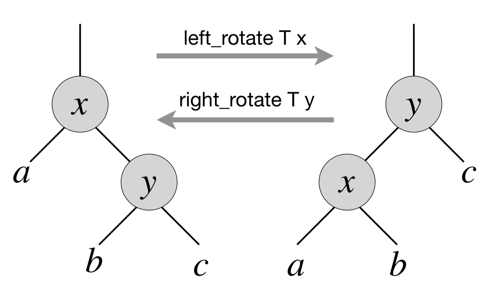

.. -*- mode: rst -*-

.. _exercises-12:

Exercises
=========

Mandatory exercises
-------------------

* :ref:`exercise-tree-prev`
  Finding a predecessor in a BST

* :ref:`exercise-right-rotate`
  Fun with BST rotations

* :ref:`exercise-tree-print`
  Natural printing of a tree of single digits

* :ref:`exercise-graph-transpose`
  Transposing a graph  

Recommended exercises
---------------------

None

.. _exercise-tree-prev:

Exercise 1
----------

Implement a procedure ``find_prev`` for finding a predecessor for an element ``e`` from the BST. It should return ``None`` if ``e`` is not present in the tree, or if it is the smallest element in it. Implement automated randomised tests for your procedure.

.. _exercise-tree-print:

Exercise 2
----------

Using the idea of ``breadth_first_search_loop``, implement a procedure for printing the tree of 1-digit integers "vertically" (i.e., as we normally draw them on a white board). 

For instance, you should be able to obtain the following output for a tree that misses one leaf (left child of the node storing ``5``)::

      4
    2   5 
   1 3   6

Here are some ideas on what you can try:

* Use BFS-like traversal to associate the "level" with each node.

* Consider keeping a structure with counters for each level to keep track of the "missing" left/right children, so they could be renderred as white spaces.

* You might want to compute the expected number of leaves at the bottom level (which depends on the height of the tree) to calculate the initial offset and the spacing between nodes at each of the higher levels.

As a bonus (for additional points), try to generalise your printing algorithm for arbitrary strings produced from the values stored in the nodes.

.. _exercise-right-rotate:

Exercise 3
----------

In a BST, *left and right rotations* exchange the node with its right/left child (if present), correspondingly. Diagrammatically, this can be represented by the following picture:

That is, via left rotation, :math:`y` becomes a parent of :math:`x` and vice versa. The implementation of left rotation of a node :math:`x` in a tree :math:`T` is given below::

  let left_rotate t x =
    match right x with
    | None -> ()
    | Some y ->
      
      (* turn y's left subtree into x's right subtree *)
      x.right := left y;
      (if left y <> None
       then (get_exn @@ left y).parent := Some x);
      
      (* link x's parent to y *)
      y.parent := parent x;

      (match parent x with 
       | None -> t.root := Some y
       | Some p -> match left p with
         | Some l when x == l ->
           p.left := Some y
         | _ ->
           p.right := Some y);
            
      (* Make x the left child of y *)
      y.left := Some x;
      x.parent := Some y      

As a part of your homework assignment:

* Argue that ``left-rotate`` does not break the invariant of BST.
* Implement ``right-rotate`` and demonstrate how it works on simple examples.
* Implement a randomised testing procedure for both ``left-rotate`` and ``right-rotate`` and check its effect on the tree, as in the examples from the lecture.
* Implement a randomized test that picks two nodes, subject to ``left-rotate`` and ``right-rotate``, and demonstrates that composing ``left-rotate`` with ``right-rotate`` (as well as ``right-rotate`` and ``left-rotate``) with the corresponding arguments does not change the initial tree. To assess this, you might need to implement a procedure for copying a tree first.

.. _exercise-graph-transpose:

Exercise 4
----------

The **transpose** of a directed graph :math:`G = (V, E)` is the graph :math:`G^T = (V, E^T)`, where :math:`E^T = \{(v, u) \in V \times V: (u, v) \in E\}`. Thus, :math:`G^T` is :math:`G` with all its edges reversed. Implement (efficient) procedures for computing :math:`G^T` from :math:`G` for mod the adjacency-list and linked representations of :math:`G`. Analysed their complexity in terms of size of :math:`G.V` and :math:`G.E`. Implement automated tests for them.
