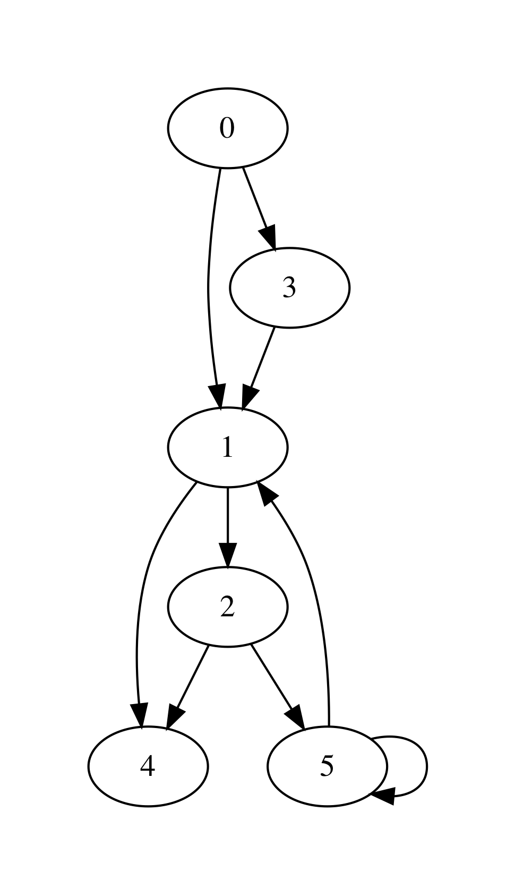

.. -*- mode: rst -*-

.. _graphs:

Representing Graphs
===================

https://github.com/ilyasergey/ysc2229-part-two/blob/master/lib/week_12_Graphs.ml

Graphs are an important versatile mathematical abstractions, which is used to represent the relations between multiple objects. Such (possibly non-symmetric) relations can be frequently phrased in terms of *connectivity* and *reachability*, as we've seen before in the chapter on :ref:`union-find`. 

A graph is commonly represented in mathematics by a pair :math:`G = (V, E)`, where :math:`V` is a set of the graphs's vertices (nodes), represented the related elements, and :math:`E` is a set of its edges (arcs) such that :math:`E \subseteq V \times V`. 

As some graph examples, :math:`V` and :math:`E` can represent correspondingly:

* Cities and roads between them
* Routers in the networks and connections between them
* Statements in a program and a control-flow transitions
* Control states of a machine and transitions between them
* "Friendship" relations between users of a social network

It is common to think of :math:`V` to be represented by a segment :math:`\{0 ... (n - 1)\}` of natural numbers for some :math:`n` (so that :math:`n` is the size of the set of vertices). However, if the nodes carry additional meaning (e.g., the name of the city), one can define their payload as a function :math:`\{0 ... (n - 1)\} \rightarrow P` for some set of payload values :math:`P`. Edges can be also given labels in a similar way by defining a function :math:`E \rightarrow L` for some label set :math:`L`.

Graphs as Adjacency Lists
-------------------------

Here is the first take on representing graphs as data s structure -- by means of *adjacency lists* (AL). In this representation an each node (a natural number) ``u`` points (e.g., as an element of an array) to a list of other nodes ``v``, that are immediately *reachable* from ``u``, i.e., the graph ``g`` has an edge ``(u, v)``.

For instance, consider the following graph:

It has 6 nodes (numbered 0-5) and can be encoded via the following array::

  [|[1; 3]; 
    [4; 2]; 
    [4; 5]; 
    [1]; 
    []; 
    [1; 5]|]

That is, for instance, the node 5 has nodes 1 and also itself as its *next* (successors) nodes, immediately reachable via the corresponding edges.

Keeping in mind the possibility of adding payload to nodes and labels to edges, we arrange the graph as the following type ``graph``::

 module AdjacencyGraphs = struct 

   type ('a, 'b) graph = {
     size : int;
     adj : int list array;
     node_payloads : (int * 'a) list ref;
     edge_labels : ((int * int) * 'b) list ref
   }

   let mk_graph n = {
     size = n;
     adj = Array.make n [];
     node_payloads = ref [];
     edge_labels = ref [];
   }

   (* More functions come here *)

 end 

Creating a graph allocates ``n`` nodes, but does not add any edges. As graphs are an inherently imperative (i.e., mutable) structure, we can add edges as follows by changing the corresponding components of the adjacency array::

  let add_edge g src dst = 
    assert (in_range g src && in_range g dst);
    let out = g.adj.(src) in
    let out' = List.filter (fun n -> n <> dst) out in
    g.adj.(src) <- dst :: out'

That is, the procedure above adds the edges ``(src, dst)`` to the graph ``g``.

Removing edges or adding labels to them can be achieved in a similar way::

  let remove_edge g src dst = 
    assert (in_range g src && in_range g dst);
    let out = g.adj.(src) in
    let out' = List.filter (fun n -> n <> dst) out in
    g.adj.(src) <- out'
    
  let set_edge_label g src dst l = 
    assert (in_range g src && in_range g dst);
    let labs = !(g.edge_labels) in
    let labs' = List.filter (fun ((s, d), _) -> (s, d) <> (src, dst)) labs in
    g.edge_labels := ((src, dst), l) :: labs'

It is not uncommon to need to have the whole set of edges. We can obtain it as follows, by traversing the entire adjacency array, returning the list of edges::

  let edges g = 
    let open Week_06.DLLBasedQueue in
    let q = mk_queue g.size in
    for i = 0 to g.size - 1 do
      let next = g.adj.(i) in
      List.iter (fun n -> enqueue q (i, n)) next
    done;
    queue_to_list q

Reading and Printing Graphs
---------------------------

Let us now suggest a way to input graphs, so they would be converted to the programmatic representation. One way to do so is to provide a size of a graph (in terms of nodes), as well as all pairs, indicating the directed edges. For instance, the graph above can be defined by the following list of strings, where the first one is its size::

 let small_graph_shape = 
   ["6";
    "0 1";
    "0 3";
    "3 1";
    "1 4";
    "1 2";
    "2 4";
    "2 5";
    "5 1";
    "5 5"]

Using the functions from the previous weeks, we can convert this list to a graph, in which node payloads are the same as node identifiers (i.e., natural numbers) using the following function::

  let adjacency_int_graph_of_strings ls = 
    let size = trimmer (List.hd ls) |> int_of_string in
    let g = mk_graph size in
    let edges = List.tl ls in
    let pairs = List.map (fun s -> trimmer s) edges |> 
                List.filter (fun s -> String.length s > 0) |>
                List.map (fun s ->
                  let splitted = splitter s in
                  let src = int_of_string @@ List.hd splitted in
                  let dst = int_of_string @@ List.hd @@ List.tl splitted in
                  (src, dst))
    in
    for i = 0 to g.size - 1 do
      set_payload g i i 
    done;
    List.iter (fun (s, d) -> add_edge g s d) pairs;
    g

In the same way, we can read a graph from the file (hence the string-based representation)::

  let read_simple_graph_shape_from_file filename =
    let ls = read_file_to_strings filename in
    adjacency_int_graph_of_strings ls

Finally, we can dump a simple graph with no payloads into a file using the following pair of functions::

  let graph_to_string g = 
    let s0 = string_of_int g.size in
    let ls = List.map (fun (s, d) -> 
      Printf.sprintf "%d %d" s d) (edges g) in
    String.concat "\n" (s0 :: ls)

  (* Dump graph to file *)
  let wirte_simple_graph_shape_to_file filename g =
    graph_to_string g |>
    write_string_to_file filename

**Question:** How would you suggest to serialize graphs with non-trivial payloads on nodes and labels on edges?

Rendering Graphs via GraphViz
-----------------------------

The simples way to visualise graphs in a nice form is to use a third-party tool `GraphViz <https://www.graphviz.org/>`_. As input, GraphViz accepts a text file in a special format, which it can then convert to an image of a graph, taking care of positioning the nodes and rendering the edges between them. Some examples ony using GraphViz can be found by `this link <https://graphs.grevian.org/example>`_.

The following functions transform a graph, represented by adjacency lists to a GraphViz-formatted string and write it to the file::

 let graphviz_string_of_graph gtyp conn vattrib eattrib g = 
   let preamble = gtyp ^ " {\n" in
   let epilogue = "}" in
   let body = 
     AdjacencyGraphs.edges g |>
     List.map (fun (s, d) -> 
         Printf.sprintf "%s %s %s %s" 
           (vattrib s) conn (vattrib d) (eattrib (s, d))) |>
     String.concat ";\n" in
   preamble ^ body ^ epilogue

 let graphviz_no_payload g out = 
   let s = graphviz_string_of_graph "digraph" " -> " 
       string_of_int (fun _ -> "") g in
   write_string_to_file out s

The function ``graphviz_string_of_graph`` takes many arguments::

* ``gtyp`` is the type of the graph to be rendered (directed/undirected);
* ``conn`` is a connective determining the shape of edges;
* ``vattrib`` is a function to render nodes;
* ``eattrib`` is a function to render edges;
* ``g`` is a graph itself in an adjacency-list representation

When run ``graphviz_no_payload g "graph.dot"`` produces a file named ``graph.dot``, which can be then rendered from the console via GraphViz-provided utility ``dot`` as follows::

 dot -Tpdf filename.dot -o outfile.pdf

Here ``filename.dot`` can be any GraphViz-formatted file (can be also named differently), and ``outfile.pdf`` is the resulting PDF file with the graph.

The image above has been obtained via GraphViz for the graph, read from ``small_graph_shape``.

Shortcomings of Adjacency-List graph representation
---------------------------------------------------

The main disadvantage of adjacency-list based representation is that the operations of adding an edge, getting successors (and possibly predecessors) of a node in it are very expensive.

Graphs as Linked Data Structures
--------------------------------

Let us consider a more efficient implementation of graphs as linked data structure. The implementation imposes some overhead, in order to provide an efficient access to the nodes of a graph as well as their adjacent neighbours. The implementation will rely on data structures developed previously: hash-tables and sets, represented via BSTs.

We start by defining the data type for nodes::

 module LinkedGraphs = struct

   (*************************************************)
   (*                     Nodes                     *)
   (*************************************************)               

   type 'a node = {
     id : int;
     value : 'a ref;
     next : int list ref;
     prev : int list ref
   }

   let get_value n = !(n.value)
   let get_next n = !(n.next)
   let get_prev n = !(n.prev)

   let add_prev node src = 
     let prev' = get_prev node |>
                 List.filter (fun n -> n <> src) in
     node.prev := src :: prev'

   let add_next node dst = 
     let next' = get_next node |>
                 List.filter (fun n -> n <> dst) in
     node.next := dst :: next'

   (* More types and functions are coming here *)

 end

Each node stores its identifier (an integer), a payload ``value``, as well as lists of "previous" and "next" nodes in the graph (initially empty). 

We now define a graph as follows::

  (*************************************************)
  (*           Auxiliary definitions               *)
  (*************************************************)               

  open Week_12_BST
  open Week_08_HashTable

  module Set = BinarySearchTree
  module NodeTable = 
    ResizableListBasedHashTable(struct type t = int end)
  module EdgeTable = 
    ResizableListBasedHashTable(struct type t = int * int end)

  type 'a set = 'a Set.tree
  
  (*************************************************)
  (*                Working with Graphs            *)    
  (*************************************************)
  
  type ('a, 'b) graph = {
    next_node_id : int ref;
    nodes : int set;
    node_map : (int * 'a node) NodeTable.hash_table;

    edges : (int * int) set;
    edge_labels : ((int * int) * 'b) EdgeTable.hash_table
  }

That is, a graph contains:

* a counter ``next_node_id`` used to allocate identifiers for newly added nodes;
* a set (represented via BST) ``nodes`` of all node identifies;
* ``node_map`` for mapping node identifiers to node objects;
* a set of edges (``edges``);
* a hash map of edge labels (``edge_labels``).

The ``graph`` structure defined just above allows to access the set of predecessors/successors of a node in a constant time, as opposed to linear one with the list-based representation. Consider the following utility functions::

  (* Graph size *)
  let v_size g = !(g.next_node_id)
  let e_size g = BinarySearchTree.get_size g.edges
  let get_nodes g = Set.elements g.nodes

  (* Refer to the node in the graph *)
  let get_node g i = Week_01.get_exn @@ NodeTable.get g.node_map i

  let get_succ g n = 
    let node = get_node g n in
    get_next node

  let get_prev g n = 
    let node = get_node g n in
    get_prev node

  let node_in_graph g n = 
    let nodes = g.nodes in
    Set.search nodes n <> None

  let edge_in_graph g src dst = 
    let nodes = g.edges in
    Set.search nodes (src, dst) <> None

As the linked ``graph`` structure combines five conceptually "overlapping" components, it needs to be maintained with a lot of care, in order not to introduce any discrepancies in the representations.

Creating new linked graph is easy::

  let mk_graph _ = {
    next_node_id = ref 0;
    nodes = Set.mk_tree ();
    node_map = NodeTable.mk_new_table 10;
    edges = Set.mk_tree ();
    edge_labels = EdgeTable.mk_new_table 10
  }

Adding a node requires allocating it a new id, registering it in both the set of node identifiers, and the node map::

  let add_node g v = 
    let new_id = !(g.next_node_id) in
    g.next_node_id := !(g.next_node_id) + 1;
    let node = {
      id = new_id;
      value = ref v;
      next = ref [];
      prev = ref [];
    } in
    (* Register node *)
    let _ = Set.insert g.nodes new_id in
    (* Register node payload *)
    NodeTable.insert g.node_map new_id node

Adding an edge requires modifying the corresponding node instances to account for new predecessors and successors::

  let add_edge g src dst = 
    let open Week_01 in
    assert (node_in_graph g src && node_in_graph g src);
    (* Register edge *)
    let _ = Set.insert g.edges (src, dst) in
    (* Add information to individual nodes *)
    let src_node = get_exn @@ NodeTable.get g.node_map src in
    let dst_node = get_exn @@ NodeTable.get g.node_map dst in
    add_prev dst_node src;
    add_next src_node dst 

We can also set a new label to an edge ``(src, dst)`` as follows::

  let set_edge_label g src dst l = 
    let open Week_01 in
    assert (node_in_graph g src && node_in_graph g src);
    assert (edge_in_graph g src dst);
    (* Register label *)
    EdgeTable.insert g.edge_labels (src, dst) l

Switching between graph representations
---------------------------------------

As we already have reading/writing implemented for AL-based graphs, let us implement conversion between them and linked representations. The following function, for instance, converts a simple AL-based graph (with arbitrary node payloads) to a linked representation::

  let from_simple_adjacency_graph (ag : ('a, 'b) AdjacencyGraphs.graph) = 
    let g = mk_graph () in
    
    (* Add nodes *)
    for i = 0 to ag.size - 1 do
      let v = snd @@ List.find (fun (n, _) -> n = i) !(ag.node_payloads) in
      add_node g v;
    done;

    (* Add edges *)
    for i = 0 to ag.size - 1 do
      ag.adj.(i) |> 
      List.map (fun n -> (i, n)) |>
      List.iter (fun (src, dst) -> add_edge g src dst)
    done;

    (* Add edge labels *)
    List.iter (fun ((src, dst), l) -> set_edge_label g src dst l) 
      !(ag.edge_labels);

    g

Conversely, the following functions obtains an adjacency graph from a linked representation::

  let to_adjacency_graph g = 
    let size = v_size g in
    let ag = AdjacencyGraphs.mk_graph size in

    (* Set node payloads *)
    Set.elements g.nodes |>
    List.iter (fun n -> 
        let node = Week_01.get_exn @@ NodeTable.get g.node_map n in
        AdjacencyGraphs.set_payload ag n (get_value node));

    (* Add edges *)
    let edges = Set.elements g.edges in
    List.iter (fun (src, dst) -> AdjacencyGraphs.add_edge ag src dst) edges;

    (* Add edges labels *)
    List.iter (fun (s, d) ->
        match EdgeTable.get g.edge_labels (s, d) with
        | None -> ()
        | Some l -> AdjacencyGraphs.set_edge_label ag s d l) edges;
    ag

We can now put those functions to use for getting linked graphs immediate from the strings and files::

  let parse_linked_int_graph ls = 
    AdjacencyGraphs.adjacency_int_graph_of_strings ls |>
    from_simple_adjacency_graph
      
  let read_simple_linked_graph_from_file filename = 
    let ag = AdjacencyGraphs.read_simple_graph_shape_from_file filename in
    from_simple_adjacency_graph ag

Testing graph operations
------------------------

One advantage of AL-based representation is that it makes it considerably easier to test graphs for certain properties. For instance, the following function checks that two AL-represented graphs have the same topology (i.e., the same sets of node identifiers, and edges between them)::

 let same_shape (ag1 : ('a, 'b) AdjacencyGraphs.graph) 
     (ag2 : ('a, 'b) AdjacencyGraphs.graph) = 
   assert (ag1.size = ag2.size);
   let n = ag1.size in
   let comp x y = if x < y 
     then - 1 
     else if x > y 
     then 1 else 0 in
   for i = 0 to n - 1 do
     let adj1 = ag1.adj.(i) |> List.sort comp in
     let adj2 = ag1.adj.(i) |> List.sort comp in
     assert (adj1 = adj2)
   done;
   true

We can use it to check that out AL-to-linked-and-back conversion preserves the graph shape. Take the following graph::

 let medium_graph_shape = 
   ["13";
    "0 1";
    "0 6";
    "0 5";
    "2 0";
    "2 3";
    "3 5";
    "5 4";
    "6 4";
    "7 6";
    "8 7";
    "6 9";
    "9 10";
    "9 11";
    "9 12";
    "11 12"]

We can now make sure that the following test succeeds::

 let%test _ =
   let ag = AdjacencyGraphs.adjacency_int_graph_of_strings medium_graph_shape in
   let g = LinkedGraphs.from_simple_adjacency_graph ag in
   let ag' = LinkedGraphs.to_adjacency_graph g in
   same_shape ag ag'

We can also try out the conversion machinery for the sake of producing nice GraphViz images::

 utop # let g = LinkedGraphs.parse_linked_int_graph medium_graph_shape;;
 utop # let ag = LinkedGraphs.to_adjacency_graph g;;
 utop # graphviz_no_payload ag "medium.dot";;

No, running::

 dot -Tpdf medium.dot -o medium.pdf

we obtain the following image:

.. image:: ../resources/medium.png
   :width: 500px
   :align: center
