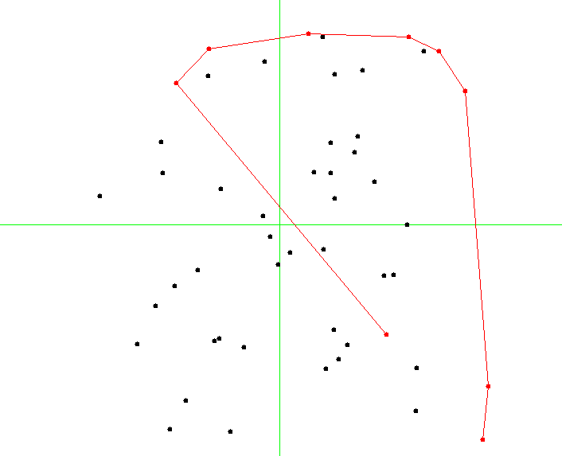

.. -*- mode: rst -*-

.. _convex:

Convex Hulls
============

https://github.com/ilyasergey/ysc2229-geometry/blob/master/lib/ConvexHulls.ml

In the last chapter of our brief introduction to problems, techniques, and algorithms of computational geometry, we take a look at a very simple yet practically relevant problem: constructing a convex hull of a set of points. A convex hull for a set of points :math:`S` is a smalles polygon (in terms of are) such that all points from :math:`S` are contained within it, or are lying on its boundary. 

The definition implies that the vertices of the polygons are some points from :math:`S`.

The image below shows an example of a convex hull for a set of 50 points:

.. image:: ../resources/cg10.png
   :width: 700px
   :align: center

Plane-sweeping algorithm
------------------------

Let us study the following elegant algorithm, known as `Graham scan <https://en.wikipedia.org/wiki/Graham_scan>`_, for computing a convex hull fora set of two-dimensional points.

The algorithm relies on sorting and implements a "plane-sweeping" intuition by considering all points in a certain sequence, making sure to include only those to the hull-in-construction, that do not disrupt the convexity property.

Our construction of a convex hull will rely on imperative stacks, which we will extend with the following definitions::

 include Polygons
 open Week_06

 module StackX (S: AbstractStack) = struct
   include S

   let top s = match pop s with
     | None -> None
     | Some x ->
       push s x;
       Some x

   let next_to_top s = match pop s with
     | None -> None
     | Some x -> 
       let y = top s in
       push s x;
       y

   let list_of_stack s = 
     let res = ref [] in
     while not (is_empty s) do
       let e = Week_01.get_exn @@ pop s in
       res := e :: !res
     done;
     !res

 end

The crux of the algorithm is to sort the set of points twice, using different comparisons:

(a) The first sort is done by :math:`y`-coordinate;
(b) The second sort is done by a radial angle from the point :math:`p_0` with a smallest :math:`y` coordinate (and leftmost of points with the smallest :math:`y`-coordinate).

For these sortins, we will need the following two procedures::

 (* Sort by axis Y *)
 let axis_y_sorter (Point (x1, y1)) (Point (x2, y2)) =
   if y1 < y2 then -1 else if y1 > y2 then 1
   else if x1 < x2 then -1 else if x1 > x1 then 1
   else 0

 (* Sort by polar angle wrt p0 *)
 let polar_angle_sorter p0 p1 p2 = 
   let Polar (r1, a1) = p1 -- p0 |> polar_of_cartesian in
   let Polar (r2, a2) = p2 -- p0 |> polar_of_cartesian in
   if a1 < a2 then -1 else if a1 > a2 then 1
   else if r1 < r2 then -1 else if r1 > r2 then 1 
   else 0

The main Graham algorithm is as follows::

 (* Graham's Scan *)
 let convex_hull points = 
   (* At least three points *)
   assert (List.length points >= 3);

   let y_sorted = List.sort axis_y_sorter points in
   let p0 = y_sorted |> List.hd in 
   let p1 :: p2 :: rest = List.tl y_sorted |> 
                          List.sort (polar_angle_sorter p0) in
   let open CHStack in
   let open Week_01 in
   let s = mk_stack 0 in
   push s p0;
   push s p1;
   push s p2; 

   let non_left_turn p = 
     let q1 = next_to_top s |> get_exn in
     let q2 = top s |> get_exn in
     direction q1 q2 p >= 0
   in

   (* Main loop *)
   List.iter (fun p ->
       while non_left_turn p do
         let _ = pop s in ()
       done;
       push s p) rest;

   list_of_stack s 

The main loop checks all the vertices in the order of the increasing angle from ``p0``, making sure that the currently build convex hull for a subset is convex. It removes the points that violat this invariants from the 

*Question:* What is the complexity of the procedure in terms of the size ``n`` of the set of points?

Graham scan invariant
---------------------

A moment from the middle of Graham scan is shown on a picture below:

It is easy to see that the invariant of the main loop is that all points in the stack ``s`` always correspond to a convex polygon containing all the points observed so far. Hence, by induction, the resulting polygon is also convex.

Since we have ways to check both these properties (convexity and containment of a point in a polygon, we can engineer the following tests for Graham scan).

First, let us generate a set of random points of a fixed size ``n``::

 let gen_random_points ?dim:(dim = 550.) n = 
   let res = ref [] in
   for _ = 0 to n - 1 do
     let p = gen_random_point dim in
     res := p :: !res
   done;
   !res

Second, let us use it in a randomised test::

 open ConvexHulls

 let test_random_ch n = 
   let ps = gen_random_points n in 
   let ch = convex_hull ps in
   assert (is_convex ch);
   assert (List.for_all (point_within_polygon ch) ps)

 let%test _ = 
   for _ = 0 to 100 do
     test_random_ch 50
   done;
   true

