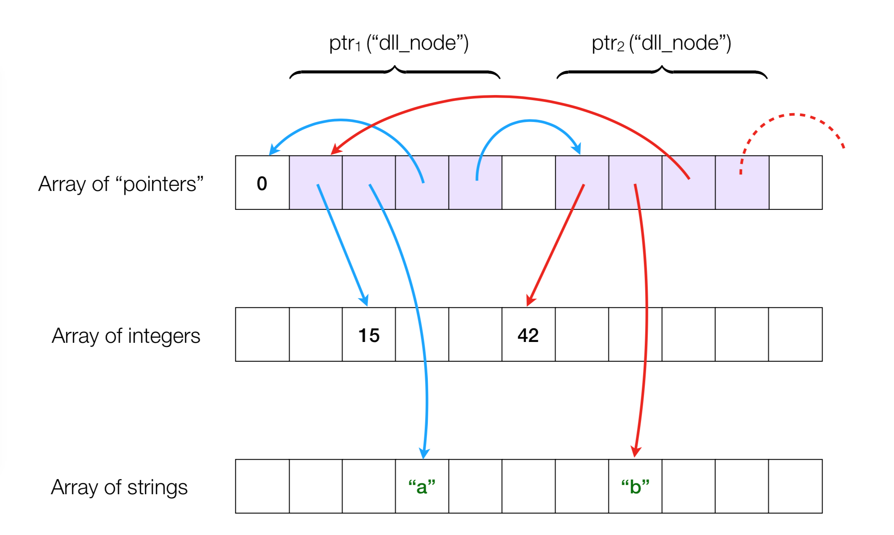

.. -*- mode: rst -*-

YSC2229: Midterm Project, Week 07
=================================

The midterm project is composed of 3 mini-projects of different sizes.

Submit your solutions and the reports, as for usual assignments, via Canvas.

You are encouraged to use Git and GitHub to efficiently coordinate and synchronise your joint efforts. If not sure how to use GitHub, feel free to send me an email or drop by during office hours.

Warm-up: missing non-negative integer
-------------------------------------

Given an array of integers, find the smallest non-negative integer that does not occur in this array.  (The array can be overwritten.) What is the complexity in time and in space of your solution?

* N.B.: The given array is unsorted, it may contain positive and negative integers, and these integers may be duplicated.

* N.B.: A solution in linear time time and constant space exists.

Use the following code to test your solution (referred to as ``candidate``)::

 let test_smallest_missing_non_negative_integer candidate =
   (candidate (Array.copy [|0; 1|]) = 2) &&
   (candidate (Array.copy [|1; 0|]) = 2) &&
   (candidate (Array.copy [|0; 1; 3; ~-4|]) = 2) &&
   (candidate (Array.copy [|1; ~-2; 3; ~-1; 0|]) = 2) &&
   (candidate (Array.copy [|3; 1; 0|]) = 2) &&
   (candidate (Array.copy [|0; 10; 3; 33; 2; 5; 100|]) = 1) &&
   (candidate (Array.copy [|0; 10; 3; 33; 2; 5; 1|]) = 4) &&
   (candidate (Array.copy [|0; 10; 11; 2; 3; 7; 6; 6; 3; 33; 2; 5; 1|]) = 4) &&
   (candidate (Array.copy [|0; 10; 11; 2; 3; ~-33; 7; 6; 4; 4; 4; 6; 3; 33; 2; 5; 1|]) = 8) &&
   (candidate (Array.copy [|1; 2; 3; 4; 5; 6; ~-33; ~-33; ~-33; 7; 8; 9; ~-33; ~-34; 12; 12; 0|]) = 10) &&
   (candidate (Array.copy [|1; 2; 3; 4; 5; 6; 7; 8; 9|]) = 0) &&
   (candidate (Array.copy [|10; 9; 8; 7; 0; 6; 5; 4; 3; 2; 1|]) = 11)
   (* etc. *);;

Array permutations
------------------

* Given an array ``a`` of values of arbitrary type ``'t``, implement a function ``permutations : 't array -> 't array list``, which generates the list of all possible permutations of the array ``a``. Write tests for this function to check that some particular "interesting" permutations are included. For instance, for an array ``a = [|1; 2; 3|]``, ``permutations a`` should return some permutation of the list::

  [[|1; 2; 3|]; [|1; 3; 2|]; [|2; 1; 3|]; [|2; 3; 1|]; [|3; 1; 2|]; [|3; 2; 1|]]

* Implement a function ``perm : 't array -> int -> 't array`` that, given an array ``a`` and a non-negative integer ``m``, returns the m-th permutation of the array. Explain how it works. You are at freedom to choose how permutations are enumerated. As an example, for ``a = [|1; 2; 3|]``, ``perm a 0`` should return ``[|1; 2; 3|]``, and ``perm a 1`` *may* return ``[|1; 3; 2|]``. Make sure that first returned ``n!`` permutations (where ``n`` is the array size) are all distinct, and upon reaching ``n!``, the cycle of the results should repeat. Your function may only use constant amount of memory besides the size of the initial array (i.e., you cannot allocate new arrays).

* **Impractical sorting:** Implement a provably correct sorting algorithm with worst-case complexity :math:`O((n + 1)!)`. Explain its correctness and describe the loop invariant.

* [Bonus] **Ridiculously impractical sorting:** Implement a provably correct sorting algorithm with worst-case complexity :math:`O(\prod_{i=1}^{n}(i!))`. Explain the complexity.

An array-based memory allocator
-------------------------------

How do we implement references and pointers in languages that do not provide them? In this mini-project you will develop solution for implementing linked data structures without an explicit ``ref`` type, by means of implementing a custom memory allocator.

In order to implement a machinery for dynamically allocating references, we notice that on can represent a collection of similar values (e.g., of type ``int`` or ``string``) by packaging them into arrays, so such arrays will play the role of random-access memory. For instance, two consecutive nodes with the payloads ``(15, "a")`` and ``(42, "b")`` of a double-linked list containing pairs of integers can be encoded by sub-segments of following three arrays: one for pointer "addresses", one for integers, and one for strings:

A list "node" (``dll_node``) is simply a segment of four consecutive entries in a pointer array, with the corresponding links to an integer and a string part of the payload. Therefore, in order to work with a double-linked list represented via three arrays, one should manipulate with the encoding of references in by means of changing the contents of those arrays. 

In this project, you are expected to deliver the following artefacts:

* An implementation of an array-based memory allocator that can provide storage (of a *fixed limited* capacity) for dynamically "allocated" pointers, integers, and strings, with a possibility of updating them. Similarly to languages without automatic memory management, such as C, it should be possible to both allocate and "free" consecutive pointer segments, making it possible to reuse the memory. The template code for the memory manager is available by `at this link <./resources/2019/memory_manager.ml>`_.

* An implementation of a double-linked list, built on top of the allocator interface via the abstract "heap" it provides and the operations for manipulating with the pointers. Feel free to extend the ``Allocator`` signature if you can think of more expressive operations with the heap.

* An implementation of a queue data type, following the `Module Signature from Week 6 <./resources/2019/week_06.ml>`_ and tests for checking that it indeed behaves like a queue.

The nature of the task imposes some restrictions and hints some observations:

* You may **not** use OCaml's references (i.e., values of type `ref`) in this mini-project.

* As you remember, pointers and arrays are somewhat similar. Specifically, most of the pointer operations expect not just the pointer ``p`` value but also a non-negative integer "offset" ``o``, so that the considered value is located by the "address" ``p + o``.

* The allocator only has to provide storage and the machinery to manipulate references storing (a) integers, (b) strings, and (c) pointers which can point to either of the three kinds of values. You are not expected to support references to any other composite data types (such as, e.g., pairs). However, you might need to encode those data types using consecutive pointers with offsets.

 

