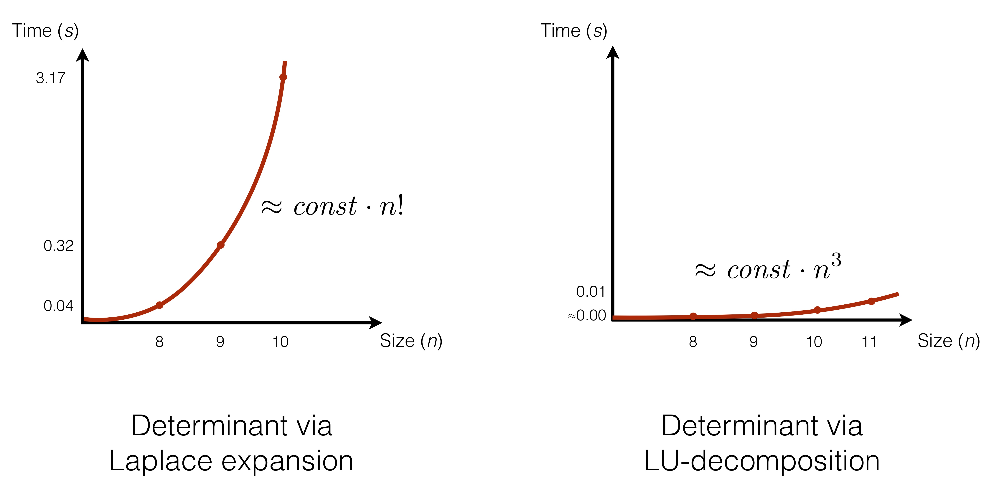

.. -*- mode: rst -*-

Complexity of Algorithms
========================

Why estimate complexity theoretically?
--------------------------------------

*Trying some math:*

If :math:`\sigma_{1}` equals :math:`\sigma_{2}` then etc, etc.

.. math::
  \langle \alpha, \beta  \rangle
  \in
  \Biggl \lbrace
  {
  M,\text{ if }
  {
  l(\underline{x}) =
        \frac { p(\underline{x}|M ) } { p(\underline{x}|U) }
        \geq
         \frac { p(U) }{ p(M) } }
  \atop
  U, \text{ otherwise }
  }

[The rest is coming soon.]
