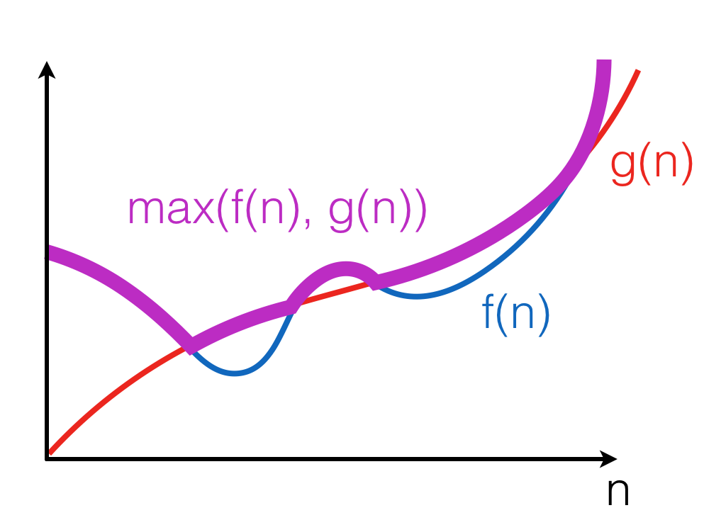

.. -*- mode: rst -*-

Order Notation
==============

Let us introduce a concise notation for *asymptotic* behaviour of time
demand functions as an input size :math:`n` of an algorithm grows
infinitely, i.e., :math:`n \rightarrow \infty`.

.. _def-big-o: 

Big-O Notation
--------------

**Definition** The positive-valued function :math:`f(x) \in O(g(x))` if and only if 
there is a value :math:`x_0` and a constant :math:`c > 0`, such that for all :math:`x \geq x_0, 
f(x) < c \cdot g(x)`.

This can be illustrated as follows:

.. image:: ../resources/bigo.png
   :width: 550px
   :align: center

The intuition is that :math:`f(x)` grows no faster than :math:`c \cdot g(x)` as :math:`x` gets larger. Notice that the notation :math:`O(g(x))` describes a *set* of functions, "approximated" by :math:`g(x)`, modulo constant factors and the starting point.

.. _def-big-o-props: 

Properties of Big O-notation
----------------------------

**Property 1:** :math:`O(k \cdot f(n)) = O(f(n))`, for any constant :math:`k`.  

Multiplying by :math:`k` just means re-adjusting the values of the arbitrary constant factor :math:`c` in the definition of big-O.  This property ensures machine-independence 
(i.e., we can forget about constant factors).  Since :math:`\log_{a}n = \log_{a}b \times \log_{b}n`, we don't need to be specific about the base when saying :math:`O(log n)`.

**Property 2:** :math:`f(n) + g(n) \in O(max(f(n), g(n))`.

Here, :math:`\max((f(n), g(n))` is a function that for any n, returns the maximum of :math:`f(n)` and :math:`g(n))`:

The property follows from the fact that for any :math:`n, 
f(n) + g(n) \leq 2 \cdot f(n)` or :math:`f(n) + g(n) \leq 2 \cdot g(n)`.  Therefore, :math:`f(n) + g(n) \leq 2 \cdot \max(f(n), g(n))`.

**Property 3:** :math:`\max(f(n), g(n)) \in O(f(n) + g(n))`.

This property follows from the fact that for any :math:`n, \max(f(n), g(n)) \leq f(n)` or :math:`\max(f(n), g(n)) \leq g(n)`. Therefore, :math:`\max(f(n), g(n)) \leq f(n) + g(n)`.

**Corollary:** :math:`O(f(n) + g(n)) = O(\max(f(n), g(n))`.

**Property 4:** If :math:`f(n) \in O(g(n))`, then :math:`f(n) + g(n) \in O(g(n))`.

Follows from the fact that there exist :math:`c, n0`, such that for any :math:`n \geq n0, f(n) \leq c \cdot g(n)`; Therefore, for any :math:`n \geq n0, f(n) + g(n) \leq (c + 1) \cdot g(n)`.
Intuitively, a faster-growing function eventually dominates.

Little o-notation
-----------------

**Definition** The positive-valued function :math:`f(x) \in o(g(x))` if and only if 
for all constants :math:`\varepsilon > 0`, there exists a value :math:`x_0`, 
such that for all :math:`x lgeq x_0, f(x) < \varepsilon \cdot g(x)`.

This definition provides a tighter boundary on :math:`f(x)`: it states that :math:`g(x)` grows much faster (i.e., more than a constant factor times faster) than :math:`f(x)`.

**Example**: :math:`x^2 \in o(x^3)`, as for any :math:`\varepsilon > 0` we can take :math:`x_0(\varepsilon) = \frac{1}{\varepsilon} + 1`, so for all :math:`x \geq x_0(\varepsilon), \varepsilon \cdot x^3 \geq \varepsilon \cdot (\frac{1}{\varepsilon} + 1) \cdot x^2 > x^2`.

Proofs using O-notation
-----------------------

**Standard exercise:** show that :math:`f(x) \in O(g(x))` (or not) is approached as follows:

* Unfold the definition of O-notation;

* Assuming that the statement is true, try to find a fixed pair of values :math:`c` and :math:`x_0` from the definition to prove that the inequality holds for any :math:`x`;

* If such *fixed* pair cannot be found, as it depends on the value of :math:`x`, then the universal quantification over :math:`x` in the definition doesn't hold, hence :math:`f(x) \notin O(g(x))`.

**Example 1**: Is :math:`n^2 \in O(n^3)`?

Assume this holds for some :math:`c` and :math:`n_0`, then:

.. math::

 \begin{align*} 
 & n^2 - c \cdot n^3 < 0,~\text{for all}~n \geq n_0 \\
 \implies & 
 n^2 (1 - c \cdot n) < 0,~\text{for all}~n \geq n_0 \\
 \implies & 
 c \cdot n < 1,~\text{for all}~n \geq n_0 \\
 \implies & 
 n > \frac{1}{c},~\text{for all}~n \geq n_0 \\
 \end{align*} 

As this clearly holds for :math:`n_0 = 2` and :math:`c = 1`, we may conclude that :math:`n^2 \in O(n^3)`. 

:math:`\square`

**Example 2**: Is :math:`n^3 \in O(n^2)`?

Assume this holds for some :math:`c` and :math:`n_0`, then:

.. math::
 \begin{align*} 
 & n^3 - c \cdot n^2 < 0,~\text{for all}~n \geq n_0 \\
 \implies & 
 n^2 \cdot (n - c) < 0,~\text{for all}~n \geq n_0 \\
 \implies & 
 n - c < 0,~\text{for all}~n \geq n_0 \\
 \end{align*} 

Now, since :math:`c` and :math:`n_0` are arbitrary, but fixed, we can consider :math:`n = c + 1 + n_0` 
(and so we can do for any :math:`c` and :math:`n_0`), so we see that the inequality doesn't hold, hence in this case no fixed :math:`c` and :math:`n_0` can be found to satisfy it for any :math:`n`. Therefore :math:`n^3 \notin O(n^2)`.

Hierarchy of algorithm complexities
-----------------------------------

TODO

Complexity of sequential composition
------------------------------------

[The rest is coming soon.]

