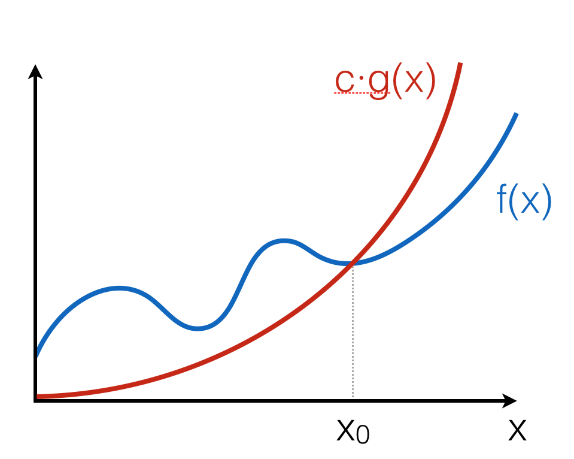
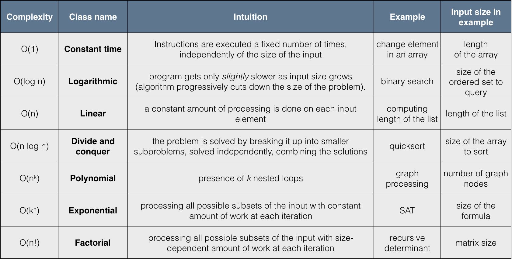

.. -*- mode: rst -*-

Order Notation
==============

Let us introduce a concise notation for *asymptotic* behaviour of time
demand functions as an input size :math:`n` of an algorithm grows
infinitely, i.e., :math:`n \rightarrow \infty`.

.. _def-big-o: 

Big O-notation
--------------

**Definition** The positive-valued function :math:`f(x) \in O(g(x))` if and only if 
there is a value :math:`x_0` and a constant :math:`c > 0`, such that for all :math:`x \geq x_0, 
f(x) \leq c \cdot g(x)`.

This can be illustrated as follows:

The intuition is that :math:`f(x)` grows no faster than :math:`c \cdot g(x)` as :math:`x` gets larger. Notice that the notation :math:`O(g(x))` describes a *set* of functions, "approximated" by :math:`g(x)`, modulo constant factors and the starting point.

.. _def-big-o-props: 

Properties of Big O-notation
----------------------------

.. admonition:: Property 1

   :math:`O(k \cdot f(n)) = O(f(n))`, for any constant :math:`k`.  

Multiplying by :math:`k` just means re-adjusting the values of the arbitrary constant factor :math:`c` in the definition of big-O.  This property ensures machine-independence 
(i.e., we can forget about constant factors).  Since :math:`\log_{a}n = \log_{a}b \times \log_{b}n`, we don't need to be specific about the base when saying :math:`O(\log~n)`.

.. admonition:: Property 2
   :math:`f(n) + g(n) \in O(\max(f(n), g(n))`

   Here, :math:`\max((f(n), g(n))` is a function that for any n, returns the maximum of :math:`f(n)` and :math:`g(n))`:

   .. image:: ../resources/omax.png
     :width: 550px
     :align: center

The property follows from the fact that for any :math:`n, 
f(n) + g(n) \leq 2 \cdot f(n)` or :math:`f(n) + g(n) \leq 2 \cdot g(n)`.  Therefore, :math:`f(n) + g(n) \leq 2 \cdot \max(f(n), g(n))`.

.. admonition:: Property 3
   
   :math:`\max(f(n), g(n)) \in O(f(n) + g(n))`.

This property follows from the fact that for any :math:`n, \max(f(n), g(n)) \leq f(n)` or :math:`\max(f(n), g(n)) \leq g(n)`. Therefore, :math:`\max(f(n), g(n)) \leq f(n) + g(n)`.

.. admonition:: Corollary 
   
   :math:`O(f(n) + g(n)) = O(\max(f(n), g(n))`.

.. admonition:: Property 4 
   
   If :math:`f(n) \in O(g(n))`, then :math:`f(n) + g(n) \in O(g(n))`.

Follows from the fact that there exist :math:`c, n0`, such that for any :math:`n \geq n0, f(n) \leq c \cdot g(n)`; Therefore, for any :math:`n \geq n0, f(n) + g(n) \leq (c + 1) \cdot g(n)`.
Intuitively, a faster-growing function eventually dominates.

Little o-notation
-----------------

.. admonition:: Definition 

   The positive-valued function :math:`f(x) \in o(g(x))` if and only if 
for all constants :math:`\varepsilon > 0`, there exists a value :math:`x_0`, 
such that for all :math:`x lgeq x_0, f(x) \leq \varepsilon \cdot g(x)`.

This definition provides a tighter boundary on :math:`f(x)`: it states that :math:`g(x)` grows much faster (i.e., more than a constant factor times faster) than :math:`f(x)`.

.. admonition:: Example 

   We can show that :math:`x^2 \in o(x^3)`, as for any
   :math:`\varepsilon > 0` we can take :math:`x_0(\varepsilon) = 
   \frac{1}{\varepsilon} + 1`, so for all :math:`x \geq
   x_0(\varepsilon), \varepsilon \cdot x^3 \geq \varepsilon \cdot
   (\frac{1}{\varepsilon} + 1) \cdot x^2 > x^2`.

Proofs using O-notation
-----------------------

**Standard exercise:** show that :math:`f(x) \in O(g(x))` (or not) is approached as follows:

* Unfold the definition of O-notation;

* Assuming that the statement is true, try to find a fixed pair of values :math:`c` and :math:`x_0` from the definition to prove that the inequality holds for any :math:`x`;

* If such *fixed* pair cannot be found, as it depends on the value of :math:`x`, then the universal quantification over :math:`x` in the definition doesn't hold, hence :math:`f(x) \notin O(g(x))`.

**Example 1**: Is :math:`n^2 \in O(n^3)`?

Assume this holds for some :math:`c` and :math:`n_0`, then:

.. math::

 \begin{align*} 
 & n^2 - c \cdot n^3 \leq 0,~\text{for all}~n \geq n_0 \\
 \implies & 
 n^2 (1 - c \cdot n) \leq 0,~\text{for all}~n \geq n_0 \\
 \implies & 
 c \cdot n \leq 1,~\text{for all}~n \geq n_0 \\
 \implies & 
 n > \frac{1}{c},~\text{for all}~n \geq n_0 \\
 \end{align*} 

As this clearly holds for :math:`n_0 = 2` and :math:`c = 1`, we may conclude that :math:`n^2 \in O(n^3)`. 

:math:`\square`

**Example 2**: Is :math:`n^3 \in O(n^2)`?

Assume this holds for some :math:`c` and :math:`n_0`, then:

.. math::
 \begin{align*} 
 & n^3 - c \cdot n^2 \leq 0,~\text{for all}~n \geq n_0 \\
 \implies & 
 n^2 \cdot (n - c) \leq 0,~\text{for all}~n \geq n_0 \\
 \implies & 
 n - c \leq 0,~\text{for all}~n \geq n_0 \\
 \end{align*} 

Now, since :math:`c` and :math:`n_0` are arbitrary, but fixed, we can consider :math:`n = c + 1 + n_0` 
(and so we can do for any :math:`c` and :math:`n_0`), so we see that the inequality doesn't hold, hence in this case no fixed :math:`c` and :math:`n_0` can be found to satisfy it for any :math:`n`. Therefore :math:`n^3 \notin O(n^2)`. 

:math:`\square`

Hierarchy of algorithm complexities
-----------------------------------

..
   +------------+------------+-----------+----------+-----------------------+
   | Complexity | Class name | Intuition | Example  | Input size in example |
   +============+============+===========+==========+=======================+
   | O(1)       | column 1   | column 2  | column 3 |  column 3             |
   +------------+------------+-----------+----------+-----------------------+
   | O(log n)   | column 1   | column 2  | column 3 |  column 3             |
   +------------+------------+-----------+----------+-----------------------+

Complexity of sequential composition
------------------------------------

Consider the following OCaml program, where ``a`` is a value of size ``n``::

  let x = f1(a) 

  in  x + f2(a)

Assuming the complexity of ``f1`` is :math:`f(n)` and the complexity of `f2` is :math:`g(n)`, executing both of them sequentially leads to summing up their complexity, which is over-approximated by :math:`O(\max(f(n), g(n))`. This process of "collapsing" big O's can be repeated for a finite number of steps, when it *does not depend* on the input size.

.. _exercise-big-o-defs1: 

Exercise 6
----------

Assume that each of the expressions below gives the time demand :math:`T(n)` of an algorithm for solving a problem of size :math:`n`. Specify the complexity of each algorithm using big :math:`O`-notation.

(a) :math:`500n + 100n^{1.5} + 50n \log_{10}n`

(b) :math:`n \log_3 n + n \log_2 n`

(c) :math:`n^2 \log_2 n + n (\log_2 n)^2`

(d) :math:`0.5 n + 6n ^{1.5} + 2.5 \cdot n ^{1.75}`

.. _exercise-big-o-defs2: 

Exercise 7
----------

The following statements provide some "properties" of the big O-notation for the functions :math:`f(n)`, :math:`g(n)` etc.  State whether each statement is `TRUE` or `FALSE`. If it's true, provide a proof sketch using the properties of the O-notation, otherwise providing a correct formulation matching the "property" name and a proof sketch while it holds.

(a) :math:`5 n + 10 n^2 + 100 n^3 \in O(n^4)`

(b) :math:`5n + 10n^2 + 100 n^3 \in O(n^2 \log n)`

(c) Rule of products: :math:`g_1 (n) \in O(f_1(n))` and :math:`g_2 (n) \in O(f_2(n))`, then :math:`g_1 (n) \cdot g_2 (n) \in O(f_1(n) \cdot f_2(n))`.
(d) Prove that :math:`T_n = c_0 + c_1 n + c_2 n^2 + c_3 n^3 \in O(n^3)` using the formal definition of the big :math:`O` notation.

.. _exercise-big-o-defs3: 

Exercise 8
----------

One of the two software packages, *A* or *B*, should be chosen to process data collections, containing each up to :math:`10^{12}` records. Average processing time of the package *A* is :math:`T_A(n) = 0.1 \cdot n \cdot \log_2 n` nanoseconds and the average processing time of the package *B* is :math:`T_B(n) = 5 \cdot n` nanoseconds. Which algorithm has better performance in the big :math:`O` sense? Work out exact conditions when these packages outperform each other.

.. _exercise-big-o-defs4: 

Exercise 9
----------

Algorithms *A* and *B* spend exactly :math:`T_A(n) = c_A \cdot n \cdot \log_2 n` and :math:`T_B(n) = c_B \cdot n^2` nanoseconds, respectively, for a problem of size :math:`n`. Find the best algorithm for processing :math:`n = 2^{20}` data items if the algorithm *A* spends 10 nanoseconds to process 1024 items, while the algorithm *B* spends only 1 nanosecond to process 1024 items.
