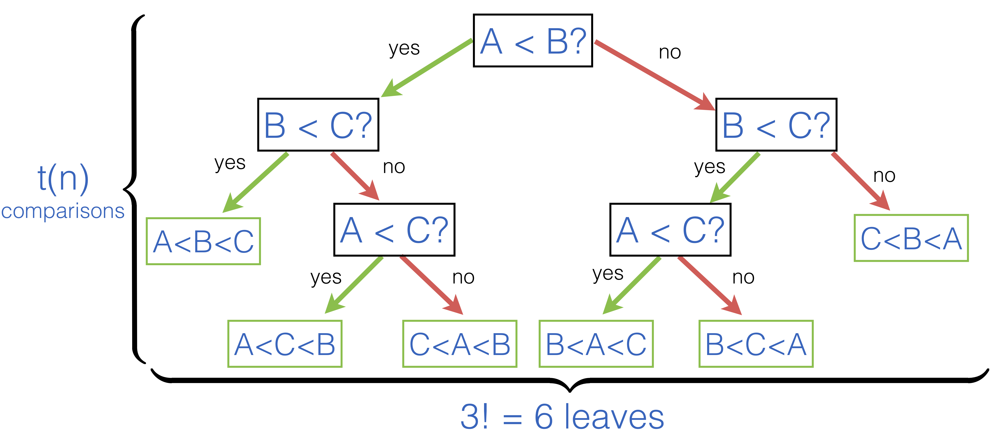

.. -*- mode: rst -*-

Best-Worst Case for Comparison-Based Sorting
============================================

A strength and a weakness of Comparison-Based Sorting is the fact that the only operation it relies in its implementation is a primitive to compare two elements. This makes it very generic and applicable to diverse classes of data, but also puts a theoretical limit on how fast (in the asymptotic big-O sence) we can sort arrays *if we use only comparison*.

Let us se what is this theoretical limit. Quicksort, Insertion sort, Merge sort are all comparison-based sorting algorithms: they compare elements pairwise. An "ideal" algorithm will always perform no more than :math:`t(n)` comparisons, for the worst possible case on an array of size :math:`n`. What is then :math:`t(n)`?  

Let us think in the following way. What a sorting delivers is a permutation of an initial array, which is also sorted. A number of possible permutations of :math:`n` elements is :math:`n!`, and such an algorithm should find "the right one" by following a path in a binary decision tree, where each node corresponds to comparing just two elements.

As an example, consider the following decision tree for an array of just three elements ``[|A; B; C|]``:

Intuitively, by making :math:`t(n)` steps in a decision tree, in its search for the "correctly ordered" permutation, the algorithm should be able to say, which ordering it is. Since the number of reachable leaves in :math:`t(n)` steps is :math:`2^{t(n)}`, and the number of possible orderings is :math:`n!`, it should be the case that

.. math::

  2^{t(n)} \geq n!

To obtain the boundary on :math:`t(n)` we need to solve this inequality. We can do so by first taking tha logarithm of the both sides:

.. math::

  t(n) \geq \log_2(n!)

We can then use `Stirling's formula <https://en.wikipedia.org/wiki/Stirling%27s_approximation>`_ for large :math:`n`, which states that :math:`n! \approx \sqrt{2\pi n}\left(\frac{n}{e}\right)^n`. Therefore, we obtain 

.. math::

  t(n) \approx n \log_e n = (\log_e 2) n \log_2 n \in O(n \log n)

With this we establish that the best possible algorithm for sorting arrays using only comparison will be deemed to perform :math:`O(n \log n)` comparisons in the worst case.

The complexity class :math:`O(n \log n)` is so paramount in the study of algorithms that it deserved its own name: computations having this complexity are often referred to as having **linearithmic** complexity.
