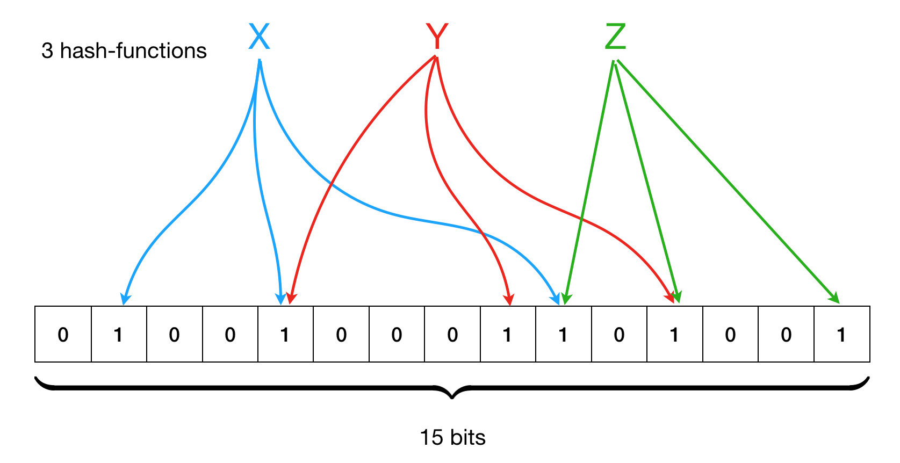

.. -*- mode: rst -*-

.. _sec_bloom:

Bloom Filters and Their Applications
====================================

Hashing can be useful not just to distribute elements in an array for the sake of implementing hash-table. we can also employ it for compactly representing the in

formation of whether a certain element is or is not in a given set.

.. admonition:: True Negatives and False Positives

  Let us notice that some applications *do not* require to always have the correct answer to the question 

  "Whether the element ``e`` is in the set ``s``"?  

  Imagine that we have a data structure, such that 

  * when the data structure answers "no" to the above question, it means "the element ``e`` is certainly not in the set ``s``", but

  * when it answers "yes" the above question, it means that "the element ``e`` might or might not be in set ``s``".

  This behaviour of the data structure is typicall called as "sound-but-incomplete". The first scenario (precise no-answer) is called "true negatives", while the case of the second scenario, in which the answer "yes" is given for a certain element *not* in the set is called "false positive" (if the element is in the set, it would be "true positive").

Data structure that give false positives, but no false negatives (answer "no" is precise), while providing a compact representation, are very useful and are employed in applications, that might tolerate imprecise "yes"-answers, given conservatively.

In this section, we will study one of such data structures called Bloom filter --- a compact representation of a "lossy" set that provides precisely this functionality. Bloom filters are widely used in practice:

* `Google Chrome <https://www.google.com/chrome/>`_ web browser used to use a Bloom filter to identify malicious URLs.

* `Medium <https://medium.com/>`_ uses Bloom filters to avoid recommending articles a user has previously read.

* `Bitcoin <https://en.wikipedia.org/wiki/Bitcoin>`_ uses Bloom filters to speed up wallet synchronisation.

High-level intuition
--------------------

Blom filter is a very simple data structure, which uses hashing. It is represented by a large boolean/bit array (you can think of it of an array of 0s and 1s) of size ``m``, and a finite number ``k`` of different hash functions, which map elements to be added to a set of interest to ``int`` (as usual). 

For each new element to be added to the set, all ``k`` hash functions are used to determine specific bits, corresponding to this element in the array. The combination of those positions is the element's "image". For instance, the following image shows a Bloom filter with ``m = 15`` and ``k = 3``, with an example of three elements, X, Y, and Z, added to it.

To determine whether an element is in the set, one needs to compute its ``k`` hashes, and check the bits in the corresponding array in a constant time (:math:`O(k)`). Having more than 1 hash function reduces the risk of collision if the number of elements is smaller than the size of the filter, however, two or more different elements can indeed had all similar ``k`` hashes.

Elements are never removed from a Bloom filter.

Bloom filter signature
----------------------

Let us first define the Bloom filter signature. It starts from the module describing the type of its elements and the list of hash functions::

 module type BloomHashing = sig
   type t
   val hash_functions : (t -> int) list  
 end

The Bloom filter itself is a functor, parameterised by ``BloomHashing``::

 module type BloomFilter = functor
   (H: BloomHashing) -> sig
   type t
   val mk_bloom_filter : int -> t
   val insert : t -> H.t -> unit
   val contains : t -> H.t -> bool
   val print_filter : t -> unit
 end

Implementing a Bloom filter
---------------------------

The implementation of Bloom filter is simply an array of booleans (which we use to represent 0/1-bits) of a fixed size::

 module BloomFilterImpl : BloomFilter = functor
   (H: BloomHashing) -> struct

   (* Type of filter *)
   type t = {
     slots : bool array;
     size  : int
   }

   (* Functions come here *)    
 end

Creation of a Bloom filter is trivial::

  let mk_bloom_filter n = 
    let a = Array.make n false in
    {slots = a; size = n}

Insertion amounts to computing all hashes for the element and setting the corresponding array bits to ``true``::

  let insert f e = 
    let n = f.size in
    List.iter (fun hash ->
        let h = (hash e) mod n in
        f.slots.(h) <- true) H.hash_functions

and to check if an element is in the filter, we need to compute all its hashes and check the corresponding bits::

  let contains f e = 
    if H.hash_functions = [] then false
    else
      let n = f.size in
      let res = ref true in
      List.iter (fun hash ->
          let h = (hash e) mod n in
          res := !res && f.slots.(h)) H.hash_functions;
      !res

We can implement a printer for the Bloom filter by means of one of the previous modules::
        
  module BP = Week_05.ArrayPrinter(struct
      type t = bool
      let pp b = if b then "1" else "0"
    end)

  let print_filter t = 
    let open BP in
    print_array t.slots

Experimenting with Bloom filters
--------------------------------

Let us fix a hashing strategy for our favourite data type ``int * string``::

 module IntStringHashing = struct
   type t = int * string
   let hash1 (k, _) = Hashtbl.hash k
   let hash2 (_, v) = Hashtbl.hash v
   let hash3 (k, _) = k 
   let hash_functions = [hash1; hash2; hash3]
 end

Instantiating the filter::

  module IntStringFilter = BloomFilterImpl(IntStringHashing)

Filling a filter from an array::

 let fill_bloom_filter m n = 
   let open IntStringFilter in
   let filter = mk_bloom_filter m in
   let a = Week_03.generate_key_value_array n in
   for i = 0 to  n - 1 do    
     insert filter a.(i)
   done;
   (filter, a)

Let's do some experiments::

 utop # let (f, a) = fill_bloom_filter 20 10;;
 val f : IntStringFilter.t = <abstr>
 val a : (int * string) array =
   [|(4, "ayuys"); (7, "cdrhf"); (4, "ukobi"); (5, "hwsjs"); (8, "uyrla");
     (0, "uldju"); (3, "rkolw"); (7, "gnzzo"); (7, "nksfe"); (4, "geevu")|]

 utop # IntStringFilter.contains f (3, "rkolw");;
 - : bool = true

 utop # IntStringFilter.contains f (13, "aaa");;
 - : bool = false

 utop # IntStringFilter.print_filter f;;
 [| 1; 0; 0; 1; 1; 1; 0; 1; 1; 1; 1; 0; 1; 0; 1; 1; 0; 1; 1; 0 |] - : unit = ()

Testing Bloom Filters
---------------------

https://github.com/ilyasergey/ysc2229-part-two/blob/master/lib/week_08_Tests.ml

Testing for no true positive::

 let%test "bloom filter true positives" = 
   let open IntStringFilter in
   let fsize = 2000 in
   let len = 1000 in
   let (f, a) = fill_bloom_filter fsize len in 
   for i = 0 to len - 1 do
     assert (contains f a.(i))
   done;
   true

Testing for true negatives::

 let%test "bloom filter false positives" = 
   let open IntStringFilter in
   let fsize = 2000 in
   let len = 1000 in
   let (f, a) = fill_bloom_filter fsize len in 
   let al = array_to_list 0 len a in

   let b = generate_key_value_array len in
   for i = 0 to len - 1 do
     let e = b.(i) in
     if (not (contains f e))
     then assert (not (List.mem e al))
   done;
   true

However, there can be also *false positives*, although we don't check for them.

Improving Simple Hash-table with a Bloom filter
-----------------------------------------------

Let us put Bloom filter to some good use by improving our simple implementation of a hash table.

The way it has been implemented, it has spent too much on iterating through the buckets before adding or getting an element. This is something that can be improved with a Bloom filter: indeed if we known that there is *no* element with a certain key in the bucket (the answer that Bloom filter can answer precisely), we don't have to look for it.

The price to pay for this speed-up is inability to remove elements from the hash-table (as one cannot remove elements from a Bloom filter).

We start our hash-table from the following preamble. Its core data structure now gets enhanced with a Bloom filter::

 module BloomHashTable (K: BloomHashing) = struct 
   type key = K.t

   (* Adding bloom filter *)
   module BF = BloomFilterImpl(K)

   type 'v hash_table = {
     buckets : 'v list array;
     capacity : int; 
     filter   : BF.t
   }
  
   (* Functions come here *)
 end

Insertion also updates the filter correspondingly::

  let insert ht k v = 
    let hs = Hashtbl.hash k in
    let bnum = hs mod ht.capacity in 
    let bucket = ht.buckets.(bnum) in
    let filter = ht.filter in
    let clean_bucket = 
      (* New stuff *)
      if BF.contains filter k
      (* Only filter if ostensibly contains key *)
      then List.filter (fun (k', _) -> k' <> k) bucket 
      else bucket in
    (* Missed in the initial the implementation *)
    BF.insert filter k;
    ht.buckets.(bnum) <- (k, v) :: clean_bucket

Fetching consults the filter first::

  let get ht k = 
    let filter = ht.filter in
    if BF.contains filter k then
      let hs = Hashtbl.hash k in
      let bnum = hs mod ht.capacity in 
      let bucket = ht.buckets.(bnum) in
      let res = List.find_opt (fun (k', _) -> k' = k) bucket in
      match res with 
      | Some (_, v) -> Some v
      | _ -> None
    else None

As announced before, removal is prohibited::

  let remove _ _ = raise (Failure "Removal is deprecated!")

Comparing performance
---------------------

Let us instantiate the Bloom-table::

 module BHT = BloomHashTable(IntStringHashing)
 module BHTTester = HashTableTester(BHT)

Similarly to methods for testing performance of previiously defined hash-tables, we implement the following function::

 let insert_and_get_bulk_bloom a m = 
   Printf.printf "Creating Bloom hash table:\n";
   let ht = Week_03.time (BHTTester.mk_test_table_from_array_length a) m in
   Printf.printf "Fetching from Bloom hash table on the array of size %d:\n" (Array.length a);
   let _ = Week_03.time BHTTester.test_table_get ht a in ()

Now, leet us compare the Bloom filter-powered simple table versus
vanilla simple hash-table::

 let compare_hashing_time_simple_bloom n m = 
   let a = Week_03.generate_key_value_array n in
   insert_and_get_bulk_simple a m;
   print_endline "";
   insert_and_get_bulk_bloom a m

Running the expriments. Not so much gain when a number of elements and
the buckets are in the same ballpark::

 utop # compare_hashing_time_simple_bloom 10000 5000;;
 Creating simple hash table:
 Execution elapsed time: 0.003352 sec
 Fetching from simple hash table on the array of size 10000:
 Execution elapsed time: 0.000001 sec

 Creating Bloom hash table:
 Execution elapsed time: 0.007994 sec
 Fetching from Bloom hash table on the array of size 10000:
 Execution elapsed time: 0.000001 sec

However, the difference is noticeable when the number of buckets is
small, and the sie of the filter is still comparable with the number
of elements being inserted::

 utop # compare_hashing_time_simple_bloom 15000 20;;
 Creating simple hash table:
 Execution elapsed time: 0.370876 sec
 Fetching from simple hash table on the array of size 15000:
 Execution elapsed time: 0.000002 sec

 Creating Bloom hash table:
 Execution elapsed time: 0.234405 sec
 Fetching from Bloom hash table on the array of size 15000:
 Execution elapsed time: 0.000000 sec
