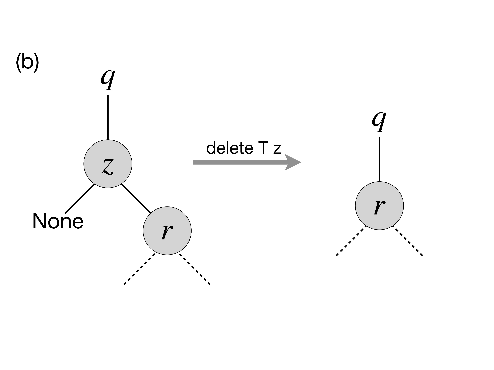
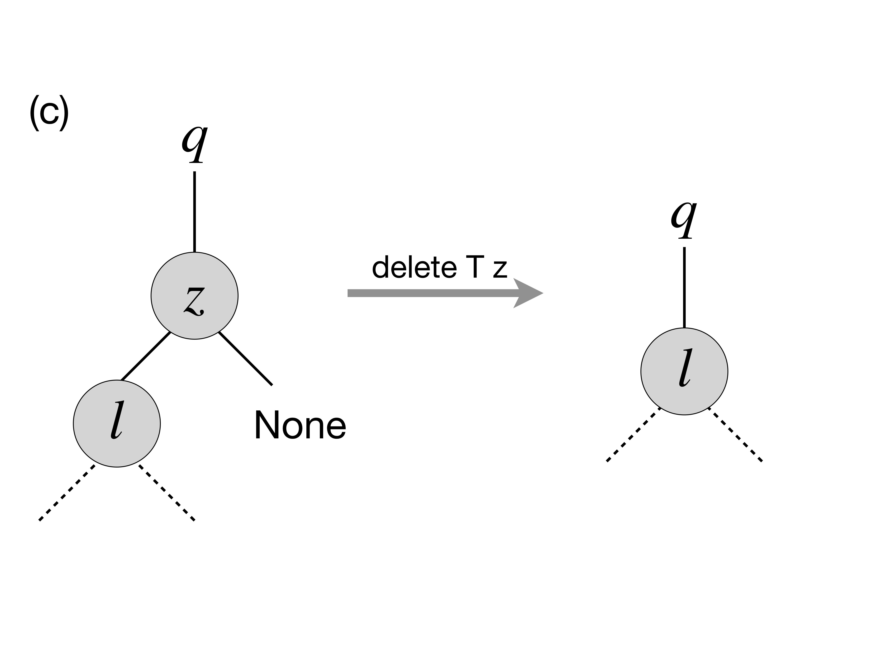
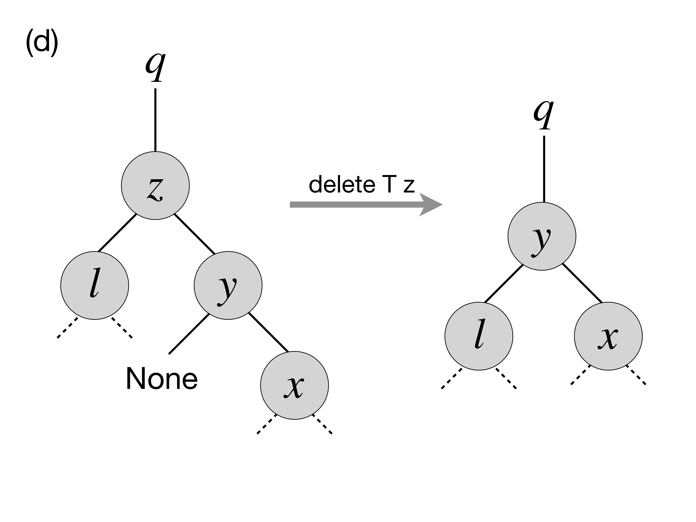
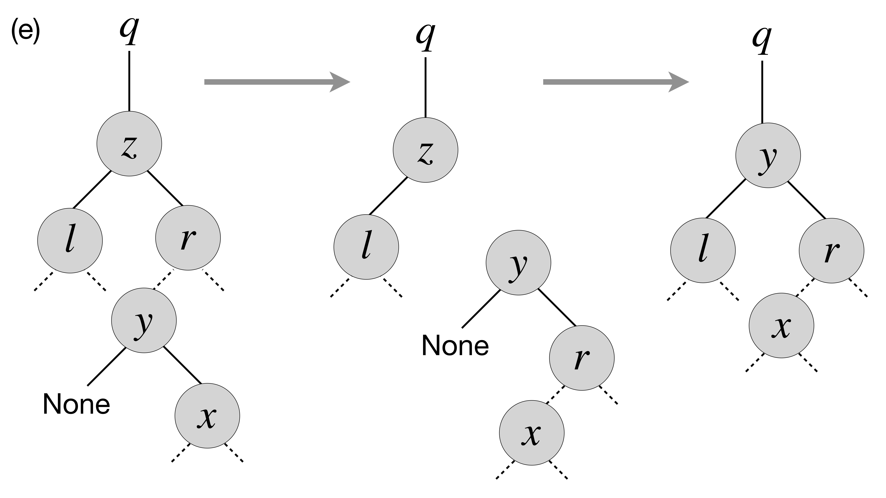

.. -*- mode: rst -*-

.. _bst:

Representing Sets via Binary Search Trees
=========================================

* File ``BST.ml``

Binary search trees (BST) are one of the most versatile representations of mutable sets, supporting a variety of operations, such as insertion, deletion, checking membership, finding minimums, maximums, predecessors and successors. 

The key to this expressivity is the invariant of a tree-shaped data structure, that mandates that, for any node,

* any element in its left subtree is less or equal than the element in the node itself, and
* any element in its right subtree is greater or equal than the element in the node itself.

This invariant is maintained by all operations that modify the set, and is relied upon by all queries. 

A Data Structure for Binary-Search Trees
----------------------------------------

We start by defining a linked in-memory data structure for BSTs in its own module. 

The tree is populated by nodes, each of which carries a value (immutable), and also maintains references (mutable) to its left/right children and a parent, which can be either absent or some other nodes::

 module BinarySearchTree = struct

   type 'e tree_node = {
     value : 'e;
     parent  : 'e tree_node option ref;
     left  : 'e tree_node option ref;
     right  : 'e tree_node option ref;
   }

   type 'e tree = {
     root : 'e tree_node option ref;
     size : int ref    
   }

   (* More definitions coming here *)

 end

For convenience, we define several operations to dereference various components of a tree and its nodes::

  let left n = !(n.left)
  let right n = !(n.right)
  let parent n = !(n.parent)
  let get_root t = !(t.root)
  let get_size t = !(t.size)

  let mk_node e = 
    {value = e;
     parent = ref None;
     left = ref None;
     right = ref None}
    
  let mk_tree _ = {root = ref None; size = ref 0}    
    
Finally, since nodes are represented by an ``option`` type, we introduce the following combinator, simplifying working with ``option``-wrapped values::

  let map_option o f z = match o with
    | None -> z
    | Some n -> f n

In words ``map_option`` returns applies ``f`` to the value ``n`` within ``o``, if ``o = Some n``, or returns ``z`` otherwise.

Inserting an element into a BST
-------------------------------

The defined above ``mk_tree`` function creates an empty tree. Let us now implement a procedure for populating it with elements by inserting them one by one::

  let insert t e =       
    let rec insert_element n e = 
      let m = mk_node e in
      if e < n.value
      then match left n with
        | Some m -> insert_element m e
        | None ->
          m.parent := Some n;
          n.left := Some m;
          true
      else if e > n.value
      then match right n with
        | Some m -> insert_element m e
        | None ->
          m.parent := Some n;
          n.right := Some m;
          true
      else false
    in
    match !(t.root) with
    | None -> (
        t.root := Some (mk_node e);
        t.size := 1;
        true)
    | Some n -> 
      if insert_element n e
      then (t.size := !(t.size) + 1; true)
      else false

Notice that the main working routine ``insert_element`` is careful with respect to the BST property defined above: it positions the node ``m`` with the element ``e``, so it would be in the right subtree (smaller-left/greater-right) with respect to its parent nodes.  Finally, ``insert_element`` returns a boolean to indicate whether the element has been indeed added (``true``) or ignored as duplicated (``false``). In the former case the size of the tree is increased, in the latter it remains the same.

Binary-Search-Tree Invariant
----------------------------

Let us now assert tree-manipulating operations such as ``insert`` indeed preserve the BST property. For this, let us define the BST invariant in the form of the following function::

  let check_bst_inv t = 
    let rec walk node p = 
      (p node.value) &&
      let res_left = match left node with
        | None -> true
        | Some l -> walk l (fun w -> p w && w <= node.value)
      in
      let res_right = match right node with
        | None -> true
        | Some r -> walk r (fun w -> p w && w >= node.value)
      in
      res_left && res_right
    in
    match !(t.root) with
    | None -> true
    | Some n -> walk n (fun _ -> true)

The main recursive sub-function ``walk`` works by "growing" a predicate ``p`` that applies to each node further down the tree, making sure that it is correctly positioned with regard to all its parents. At the top level ``p`` is instantiated with ``(fun _ -> true)``, as there are no restrictions imposed for the root of the tree, but more and more conjuncts added, as the checking proceeds recursively.

Testing Tree Operations
-----------------------

Let us put or invariant to work by using it to test the correctness of ``insert``.

We do so by first defining a function for generating random trees from random arrays via insertion::

 open BinarySearchTree

 let mk_tree_of_size n =
   let t = mk_tree () in
   let a = generate_key_value_array n in
   for i = 0 to n - 1 do 
     insert t a.(i)
   done;
   t

Next, we check that the generated trees indeed satisfy the BST property::

 let%test "Testing insertion" = 
   let n = 1000 in
   let t = mk_tree_of_size n in
   check_bst_inv t

Printing a Tree
---------------

It would be very nice if we could not only test but also visualise our binary search trees.

Unfortunately, printing a tree in a standard top-down fashion requires quite a bit of book-keeping of tree-specific information (implementation of a this procedure in a particular case is left to you as a homework assignment). Printing a tree left-to-right is, however, can be done quite easily as follows::

  let print_tree pp snum t = 
    let print_node_with_spaces l s = 
      for i = 0 to s - 1 do 
        Printf.printf " "
      done;
      print_endline (pp l.value);
    in

    let rec walk s node = match node with
      | None -> ()
      | Some n -> begin
          walk (s + snum) (right n);
          print_node_with_spaces n s;
          walk (s + snum) (left n);
        end      

    in
    map_option (get_root t) (fun n -> walk 0 (Some n)) ()

The first auxiliary function  ``print_node_with_spaces`` Prints a string of ``s`` spaces and the value of a node ``l``. 

The second function ``walk`` traverses the tree recursively, accumulating the "offset" proportionally to the depth of the tree node. It first prints the right sub-tree, then the node itself and then the left sub-tree, making use of the accumulated offset for printing the necessary number of spaces. Finally, it runs ``walk`` for the top-level root node, if it exists.

Let us observe the effect of ``print_tree`` by instantiating it to print trees of key-value pairs::

  let print_kv_tree = print_tree 
      (fun (k, v) -> Printf.sprintf "(%d, %s)" k v) 12

We can now use ``utop`` to experiment with it::

 utop # open BST;;
 utop # open BinarySearchTree;;
 utop # let t = mk_tree ();;
 val t : '_weak1 tree = {root = {contents = None}}
 utop # let a = 
   [|(4, "ayuys"); (7, "cdrhf"); (4, "ukobi"); (5, "hwsjs"); (8, "uyrla");
     (0, "uldju"); (3, "rkolw"); (7, "gnzzo"); (7, "nksfe"); (4, "geevu")|]
 utop # for i = 0 to 9 do insert t a.(i) done;;
 - : unit = ()
 utop # print_kv_tree t;;
                         (8, uyrla)
                                                 (7, nksfe)
                                     (7, gnzzo)
             (7, cdrhf)
                                     (5, hwsjs)
                         (4, ukobi)
                                     (4, geevu)
 (4, ayuys)
                         (3, rkolw)
             (0, uldju)
 - : unit = ()

That is, on can see that ``(4, "ayuys")`` is the root of the tree, and the whole structure satisfies the BST property.

Searching Elements
------------------

We define the ``search`` function so it would return not just the element, but also the node that contains it. It does so by recursively traversing the tree, while relying on its BST property::

  let search t k = 
    let rec walk k n = 
      let nk = n.value in 
      if k = nk then Some n
      else if k < nk
      then match left n with
        | None -> None
        | Some l -> walk k l
      else match right n with
        | None -> None
        | Some r -> walk k r
    in
    map_option (get_root t) (walk k) None

In the absence of the abstract module signature, it is quite dangerous to return a node (node just its value), as one can break the BST properties, by checking its mutable components. However, returning a node also simplifies the implementation of various testing and manipulation procedures, specifically, deletion of tree nodes. 

Tree Traversals
---------------

There are multiple ways to flatten a tree into a list, which can be convenient for the sake of testing and other inspections. 

The simples way to do it is via an accumulator (implemented as a mutable queue) and a procedure, known as Depth-First-Search (DFS), which traverses the tree recursively, following its shape::

  open Queues
  open DLLBasedQueue

  let depth_first_search_rec t = 
    let rec walk q n =
      enqueue q n.value;
      (match left n with
       | Some l -> walk q l
       | None -> ());
      (match right n with
       | Some r -> walk q r
       | None -> ());
    in
    let acc = (mk_queue 0) in
    map_option (get_root t) (walk acc) ();
    queue_to_list acc

Keeping in mind the correspondence between implicit call stack and explicit call stack, we can rewrite this procedure without relying on recursion, but using an explicit stack instead::

  open Stacks

  let depth_first_search_loop t = 
    let open ListBasedStack in
    let loop stack q =
      while not (is_empty stack) do
        let n = get_exn @@ pop stack in
        enqueue q n.value;
        (match right n with
         | Some r -> push stack r
         | _ -> ());
        (match left n with
         | Some l -> push stack l
         | _ -> ());
      done
    in
    let acc = (mk_queue 0) in
    let stack = mk_stack 0 in
    (match get_root t with
    | None -> ()
    | Some n -> begin
        push stack n;
        loop stack acc;
      end);      
    queue_to_list acc

With the stack (implicit or explicit), DFS traverses the tree in a Last-In-First-Out mode (LIFO). By replacing the stack with a mutable queue (First-In-First-Out, FIFO), we can obtain an alternative traversal, known as Breadth-First-Search (BFS), so it would accumulate tree elements by following its "layers"::

  let breadth_first_search_loop t = 

    let loop wlist q depth =
      while not (is_empty wlist) do
        let n = get_exn @@ dequeue wlist in
        enqueue q n.value;
        (match left n with
         | Some l -> enqueue wlist l
         | _ -> ());
        (match right n with
         | Some r -> enqueue wlist r
         | _ -> ());
      done
    in
    let acc = (mk_queue 0) in
    let wlist = mk_queue 0 in
    (match get_root t with
    | None -> ()
    | Some n -> begin
        enqueue wlist n;
        loop wlist acc 0;
      end);      
    queue_to_list acc

Notice that the code of ``depth_first_search_loop`` and ``breadth_first_search_loop`` is almost identical, modulo the used container data structure and its operations (e.g., ``enqueue``/``push`` and ``dequeue``/``pop``).

We can also define all elements of the set in terms of the traversal::

  let elements t = breadth_first_search_loop t

Testing Element Retrieval and Tree Traversals
---------------------------------------------

As we know well how to work with lists, we can use traversals to test each other, as well as the ``search`` function::

 (******************************************)
 (*          Testing traversals            *)
 (******************************************)

 let check_elem_in_tree t e = 
   let n = search t e in
   (get_exn @@ n).value = e

 let%test "Testing DFS" = 
   let n = 1000 in
   let t = mk_tree_of_size n in
   let l1 = depth_first_search_rec t in
   let l2 = depth_first_search_loop t in
   List.length l1 = n && l1 = l2 &&
   List.for_all (fun e -> check_elem_in_tree t e) l1

 let%test "Testing BFS" = 
   let n = 1000 in
   let t = mk_tree_of_size n in
   let l1 = depth_first_search_rec t in
   let l2 = breadth_first_search_loop t in
   List.length l1 = n && 
   List.for_all (fun e -> List.mem e l2) l1 &&
   List.for_all (fun e -> List.mem e l1) l2

 (******************************************)
 (*          Testing retrieval             *)
 (******************************************)

 let%test "Testing retrieval" = 
   let n = 1000 in
   let t = mk_tree_of_size n in
   let m = Random.int n in
   let l = breadth_first_search_loop t in
   let e = List.nth l m in
   let z = search t e in
   z <> None

More BST operations
-------------------

Thanks to its invariant, a BST makes it almost trivial to implement operations, such as

* Getting minimum/maximum element in a set representing by a tree
* Find a successor/predecessor of an element

For instance, finding the minimal element of a subtree starting from a node ``n`` can be achieved by the following operation::

  let rec find_min_node n = 
    match left n with
    | Some m -> find_min_node m
    | None -> n

Deleting a node from BST
------------------------

Deletion of a node from a BST is the most complicated operation, as it requires significant restructuring of the tree in order to maintain its invariant.

Deletion of a non-leaf node from a tree will require some other nod to take its place. This can be achieved by the following operation for performing "transplantation" of one node by another::

  (* Replacing node U by (optional) node V in T. *)
  let transplant t u v = 
    (match parent u with
    | None -> t.root := v
    | Some p -> 
      match left p with
      | Some l when u == l -> p.left := v
      | _ -> p.right := v);
    (* Update parent of v *)
    match v with 
    | Some n -> n.parent := parent u
    | _ -> ()

Let us now discuss possible scenarios for removing a node ``z`` from the tree ``T`` by preserving the BST property.

(a) The simplest case is when ``z`` is a leaf, so we can simply remove it.

(b) The node ``z`` has no left child. In this case, we can simply replace it by its right child (argue, why this is correct) as on the picture below:

(c) A similar situation takes place when ``z`` has only the left child, which replaces it (via ``transplant``):

(d) In the case when ``z`` has two children, we need to look up for the node that corresponds to its successor in the ordering of elements. In this particular case, such a successor, ``y``, is the immediate right child of ``z`` that has no left child itself (convince yourself that in this case ``y`` is indeed a successor of ``z``), therefore we can transplate ``y`` to replace ``z``: 

(e) Finally, in the most nasty case, ``y``, the successor of ``z``, is deep below ``z``, and potentially hasa right child (but no left child, otherwise it wouldn't be the successor of ``z``) . In this case we need to make to perform the transformation as follows:

Specifically, in the last case we first transplant ``y`` and its right child ``x`` and then make ``r``, the former right child of ``z`` to be the right child of ``y``. After that we simply transplant ``y`` to the place of ``z``. 

The full code of deletion is as follows::

  let delete_node t z = 
    t.size := !(t.size) - 1;
    if left z = None
    then transplant t z (right z)
    else if right z = None
    then transplant t z (left z)
    else
      (* Finding the successor of `z` *)
      let z_right_child = (get_exn @@ right z) in
      let y = find_min_node z_right_child in
      (* Fact: `y` has no left child *)

      (if parent y <> None &&
          z != get_exn @@ parent y
       then 
      (*  If y is not immediately under z,
          replace y by its right subtree *)
         let x = right y in
         (transplant t y x;
          y.right := right z;
          (get_exn @@ right y).parent := Some y));

      (* Now `y` replaces `z` at its position *)
      transplant t z (Some y);
      y.left := !(z.left);
      (get_exn @@ left y).parent := Some y

How would we test deletion? We can do so by generating a random BST, choosing a random node in it ``z``, and then checking the following properties for the modified tree after the deletion of ``z``:

* The tree still satisfies the BST invariant;
* It has the same number of elements;
* All elements from the modified tree plus the deleted one are the elements of the old tree.

These checks can be automatically performed by the following function, parameterised by the size of the tree::

 let test_delete n = 
   let t = mk_tree_of_size n in
   let m = Random.int n in
   let l = breadth_first_search_loop t in
   let e = List.nth l m in
   let z = get_exn @@ search t e in
   delete_node t z;
   (* Checkign the tree invariant *)
   assert (check_bst_inv t);

   (* Checkign the tree size *)
   let ld = breadth_first_search_loop t in
   assert (List.length ld = n - 1);

   (* Checking integrity *)
   assert (List.for_all (fun x -> List.mem x ld || x == e) l)

BST Rotations
-------------

In a BST, *left and right rotations* exchange the node with its right/left child (if present), correspondingly. Diagrammatically, this can be represented by the following picture:

.. image:: ../resources/rotations.png
   :width: 700px
   :align: center

That is, via left rotation, :math:`y` becomes a parent of :math:`x` and vice versa. The implementation of left rotation of a node :math:`x` in a tree :math:`T` is given below::

  let left_rotate t x =
    match right x with
    | None -> ()
    | Some y ->
      
      (* turn y's left subtree into x's right subtree *)
      x.right := left y;
      (if left y <> None
       then (get_exn @@ left y).parent := Some x);
      
      (* link x's parent to y *)
      y.parent := parent x;

      (match parent x with 
       | None -> t.root := Some y
       | Some p -> match left p with
         | Some l when x == l ->
           p.left := Some y
         | _ ->
           p.right := Some y);
            
      (* Make x the left child of y *)
      y.left := Some x;
      x.parent := Some y      

When a subtree is rotated, the subtree side upon which it is rotated increases its height by one node while the other subtree decreases its height. This makes tree rotations useful for rebalancing a tree when it becomes "degenerate" (tall and thin). This makes it possible to keep the worst-case complexity of tree operations within :math:`O(n \log n)`, without it generating to :math:`O(n)`.
 
Implementation of the right BST rotation and rotation testing are left as an exercise.
