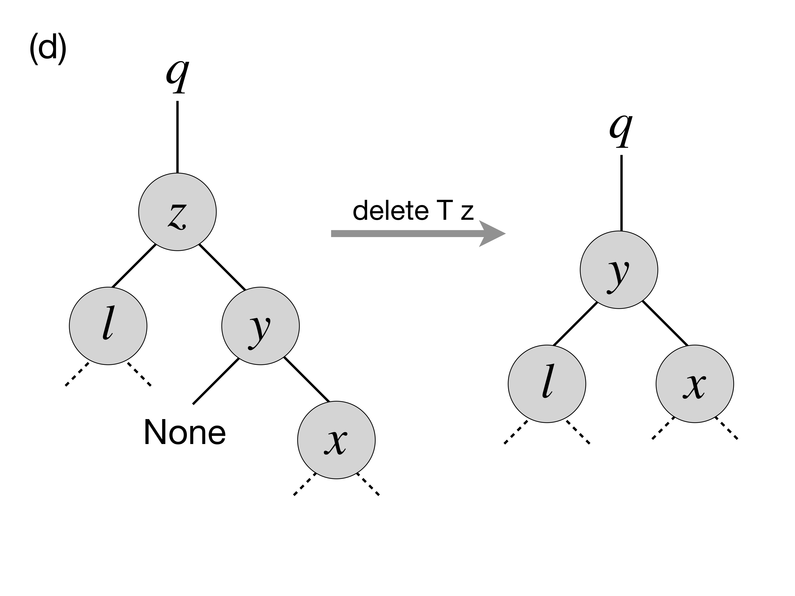
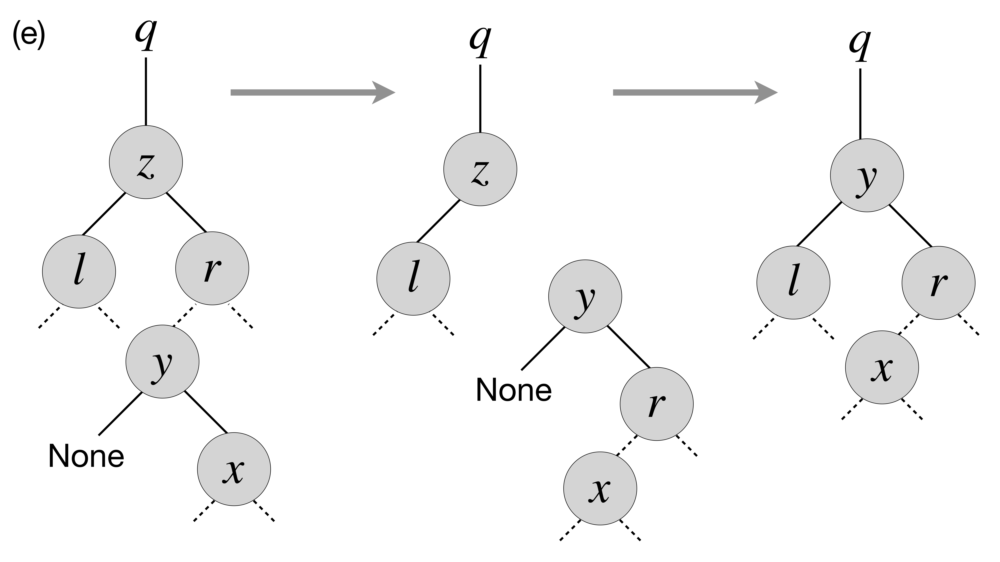

.. -*- mode: rst -*-

.. _bst:

Representing Sets via Binary Search Trees
=========================================

https://github.com/ilyasergey/ysc2229-part-two/blob/master/lib/week_11_BinaryTree.ml

Binary-Search-Tree invariant
----------------------------

Inserting a node to a BST
-------------------------

Tree Traversals
---------------

More BST operations
-------------------

Thanks to its invariant, a BST makes it almost trivial to implement operations, such as

* Getting minimum/maximum element in a set representing by a tree
* Find a successor/predecessor of an element

For instance, finding the minimal element of a subtree starting from a node ``n`` can be achieved by the following operation::

  let rec find_min_node n = 
    match left n with
    | Some m -> find_min_node m
    | None -> n

Deleting a node from BST
------------------------

Deletion of a node from a BST is the most comlicated operation, as it requires significant restructuring of the tree in order to maintain its invariant.

Deletion of a non-leaf node from a tree will require some other nod to take its place. This can be achieved by the following operation for performing "transplantation" of one node by another::

  (* Replacing node U by (optional) node V in T. *)
  let transplant t u v = 
    (match parent u with
    | None -> t.root := v
    | Some p -> 
      match left p with
      | Some l when u == l -> p.left := v
      | _ -> p.right := v);
    (* Update parent of v *)
    match v with 
    | Some n -> n.parent := parent u
    | _ -> ()

Let us now discuss possible scenarios for removing a node ``z`` from the tree ``T`` by preserving the BST property.

(a) The simplest case is when ``z`` is a leaf, so we can simply remove it.

(b) The node ``z`` has no left child. In this case, we can simply replace it by its right child (argue, why this is correct) as on the picture below:

.. image:: ../resources/delete-b.png
   :width: 700px
   :align: center

(c) A similar situation takes place when ``z`` has only the left child, which replaces it (via ``transplant``):

.. image:: ../resources/delete-c.png
   :width: 700px
   :align: center

(d) In the case when ``z`` has two children, we need to look up for the node that corresponds to its successor in the ordering of elements. In this particular case, such a successor, ``y``, is the immediate right child of ``z`` that has no left child itself (convince yourself that in this case ``y`` is indeed a successor of ``z``), therefore we can transplate ``y`` to replace ``z``: 

(e) Finally, in the most nasty case, ``y``, the successor of ``z``, is deep below ``z``, and potentially hasa right child (but no left child, otherwise it wouldn't be the successor of ``z``) . In this case we need to make to perform the transformation as follows:

Specifically, in the last case we first transplant ``y`` and its right child ``x`` and then make ``r``, the former right child of ``z`` to be the right child of ``y``. After that we simply transplant ``y`` to the place of ``z``. 

The full code of deletion is as follows::

  let delete_node t z = 
    if left z = None
    then transplant t z (right z)
    else if right z = None
    then transplant t z (left z)
    else
      (* Finding the successor of `z` *)
      let z_right_child = (get_exn @@ right z) in
      let y = find_min_node z_right_child in
      (* Fact: `y` has no left child *)

      (if parent y <> Some z
       then 
      (*  If y is not immediately under z,
          replace y by its right subtree *)
         let x = right y in
         (transplant t y x;
          y.right := right z;
          (get_exn @@ right y).parent := Some y));

      (* Now `y` replaces `z` at its position *)
      transplant t z (Some y);
      y.left := !(z.left);
      (get_exn @@ left y).parent := Some y

How would we test deletion? We can do so by generating a random BST, choosing a random node in it ``z``, and then checking the following properties for the modified tree after the deletion of ``z``:

* The tree still satisfies the BST invariant;
* It has the same number of elements;
* All elements from the modified tree plus the deleted one are the elements of the old tree.

These checks can be automatically performed by the following function, parameterised by the size of the tree::

 let test_delete n = 
   let t = mk_tree_of_size n in
   let m = Random.int n in
   let l = breadth_first_search_loop t in
   let e = List.nth l m in
   let z = get_exn @@ search t e in
   delete_node t z;
   (* Checkign the tree invariant *)
   assert (check_bst_inv t);

   (* Checkign the tree size *)
   let ld = breadth_first_search_loop t in
   assert (List.length ld = n - 1);

   (* Checking integrity *)
   assert (List.for_all (fun x -> List.mem x ld || x == e) l)

 
