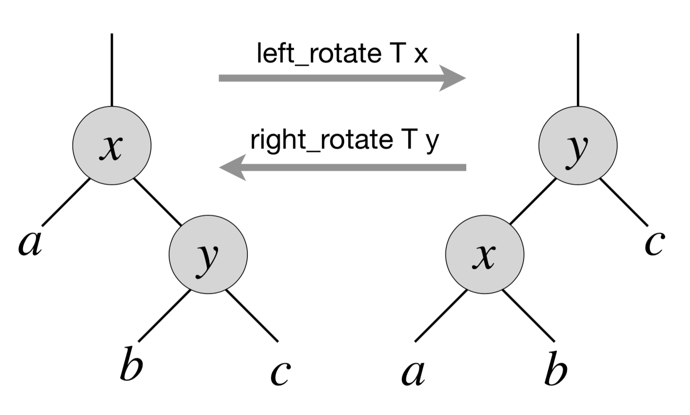

.. -*- mode: rst -*-

.. _exercises-11:

Exercises
=========

Mandatory exercises
-------------------

* :ref:`exercise-rle-decoder`
  RLE decoder

* :ref:`exercise-fixed-length`
  Fixed-length code

* :ref:`exercise-uf-compression`
  Union-Find with path compression

* :ref:`exercise-tree-prev`
  Finding a predecessort in a BST

* :ref:`exercise-right-rotate`
  Fun with BST rotations

Recommended exercises
---------------------

* :ref:`exercise-tree-print`
  Natural printing of a tree of digits

.. _exercise-rle-decoder:

Exercise 1
----------

Implement a decoder for the binary compression based on Run-Length Evaluation described in Section :ref:`week-11-rle`. Test it by composing it with the binary compression/decompression of DNA strings as follows: DNA -> Binary DNA -> RLE compression -> RLE Decompression -> Binary DNA -> DNA to ensure that the initial input and the final output are identical.

Implement a pair of standalone compression runners for RLE-based compression of binaries, similarly to what has been implemented in Section :ref:`week-11-huffman`.

.. _exercise-fixed-length:

Exercise 2
----------

Implement a variation of RLE (see Section :ref:`week-11-rle`) that uses fixed-length encoding (i.e., all lengths are encoded via a code of a fixed size) to compress ASCII (8-bit character) strings that have relatively few different characters with many contiguous repetitions, such as ``AAAAAAAAAAAAAAACCCBBBBBBBBBBBBBBBBAAAAAAAAAAAAAAAAEEEEEE``.

Design the encoding for representing the alphabet (relevant characters in the encoded string), used to associate characters with lengths of the occurrences (you might not need to account for all ASCII characters, but only for those that occur in your string). Store this alphabet representation along with the encoded string, so it could be used for decoding. Implement a randomised test generator producing strings, on which this compression will work well and use it for automated testing of your compression/decompression procedure.

.. _exercise-tree-prev:

Exercise 3
----------

Implement a procedure ``find_prev`` for finding a predecessor for an element ``e`` from the BST. It should return ``None`` if ``e`` is not present in the tree, or if it is the smallest element in it. Implement automated randomised tests for your procedure.

.. _exercise-uf-compression:

Exercise 4
----------

Implement a version of Union-Find to include *path compression*, by adding a code to ``find`` that links every element on the path from ``p`` to the root (thus making a short-cut for the path). Give a sequence of inputs that causes thie function to produce a path of length 4 (and compress it). *Note*: The amortised cost per operation for this algorithm is known to be logarithmic.

.. _exercise-tree-print:

Exercise 5
----------

Using the idea of ``breadth_first_search_loop``, implement a procedure for printing the tree of 1-digit integers "vertically" (i.e., as we normally draw them on a white board). 

For instance, you should be able to obtain the following output for a tree that misses one leaf (left child of the node storing ``5``)::

      4
    2   5 
   1 3   6

Here are some ideas on what you can try:

* Use BFS-like traversal to associate the "level" with each node.

* Consider keeping a structure with counters for each level to keep track
  of the "missing" left/right children, so they could be renderred as
  white spaces.

* You might want to compute the expected number of leaves at the
  bottom level (which depends on the height of the tree) to calculate
  the initial offset and the spacing between nodes at each of the
  higher levels.

As a bonus (for additional points), try to generalise your printing algorithm for arbitrary strings produced from the values stored in the nodes.

.. _exercise-right-rotate:

Exercise 6
----------

In a BST, *left and right rotations* exchange the node with its right/left child (if present), corresdpondingly. Diagrammatically, this can be represented by the following picture:

That is, via left rotation, :math:`y` becomes a parent of :math:`x` and vice versa. The implementation of left rotation of a node :math:`x` in a tree :math:`T` is given below::

  let left_rotate t x = 
    match right x with
    | None -> ()
    | Some y ->

      (* turn y's left subtree into x's right subtree *)
      x.right := left y;
      (if left y <> None
       then (get_exn @@ left y).parent := Some x);

      (* link x's parent to y *)
      (if parent x = None 
       then t.root := Some y
      else if Some x = left (get_exn @@ parent x) 
      then (get_exn @@ parent x).left := Some y
      else (get_exn @@ parent x).right := Some y);

      (* Make x the left child of y *)
      y.left := Some x;
      x.parent := Some y

As a part of your homework assignment:

* Argue that ``left-rotate`` does not break the invariant of BST.
* Implement ``right-rotate`` and demonstrate how it works on simple examples.
* Implement a randomised testing procedure for both ``left-rotate`` and ``right-rotate`` and check its effect on the tree, as in the examples from the lecture.
* Implement a randomized test that picks two nodes, subject to ``left-rotate`` and ``right-rotate``, and demonstrates that composing ``left-rotate`` with ``right-rotate`` (as well as ``right-rotate`` and ``left-rotate``) with the corresponding arguments does not change the initial tree. To assess this, you might need to implement a procedure for copying a tree first.
