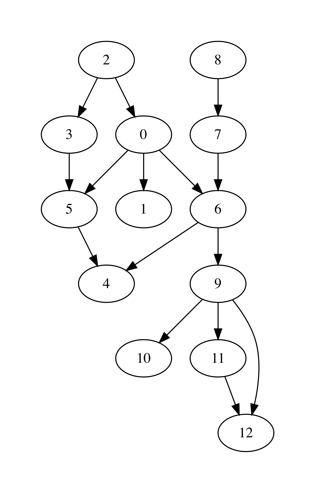

.. -*- mode: rst -*-

.. _linked-graphs:

Graphs as Linked Data Structures
================================

* File ``Graphs.ml``

Let us consider a more efficient implementation of graphs as a linked
heap-based data structure. The implementation features some
redundancy, in order to provide an efficient access to the nodes of a
graph as well as their adjacent neighbours. The implementation will
rely on data structures developed previously: hash-tables and sets,
represented via BSTs.

We start by defining the data type for nodes::

 module LinkedGraphs = struct

   (*************************************************)
   (*                     Nodes                     *)
   (*************************************************)               

   type 'a node = {
     id : int;
     value : 'a ref;
     next : int list ref;
     prev : int list ref
   }

   let get_value n = !(n.value)
   let get_next n = !(n.next)
   let get_prev n = !(n.prev)

   let add_prev node src = 
     let prev' = get_prev node |>
                 List.filter (fun n -> n <> src) in
     node.prev := src :: prev'

   let add_next node dst = 
     let next' = get_next node |>
                 List.filter (fun n -> n <> dst) in
     node.next := dst :: next'

   (* More types and functions are coming here *)

 end

Each node stores its identifier (an integer), a payload ``value``, as well as lists of "previous" and "next" nodes in the graph (initially empty). 

We now define a graph as follows::

  (*************************************************)
  (*           Auxiliary definitions               *)
  (*************************************************)               

  open BST
  open BetterHashTable

  module Set = BinarySearchTree
  module NodeTable = 
    ResizableListBasedHashTable(struct type t = int end)
  module EdgeTable = 
    ResizableListBasedHashTable(struct type t = int * int end)

  type 'a set = 'a Set.tree
  
  (*************************************************)
  (*                Working with Graphs            *)    
  (*************************************************)
  
  type ('a, 'b) graph = {
    next_node_id : int ref;
    nodes : int set;
    node_map : (int * 'a node) NodeTable.hash_table;

    edges : (int * int) set;
    edge_labels : ((int * int) * 'b) EdgeTable.hash_table
  }

That is, a graph contains:

* a counter ``next_node_id`` used to allocate identifiers for newly added nodes;
* a set (represented via BST) ``nodes`` of all node identifies;
* ``node_map`` for mapping node identifiers to node objects;
* a set of edges (``edges``);
* a hash map of edge labels (``edge_labels``).

The ``graph`` structure defined just above allows to access the set of predecessors/successors of a node in a constant time, as opposed to linear one with the list-based representation. Consider the following utility functions::

  (* Graph size *)
  let v_size g = !(g.next_node_id)
  let e_size g = BinarySearchTree.get_size g.edges
  let get_nodes g = Set.elements g.nodes

  (* Refer to the node in the graph *)
  let get_node g i = get_exn @@ NodeTable.get g.node_map i

  let get_succ g n = 
    let node = get_node g n in
    get_next node

  let get_prev g n = 
    let node = get_node g n in
    get_prev node

  let node_in_graph g n = 
    let nodes = g.nodes in
    Set.search nodes n <> None

  let edge_in_graph g src dst = 
    let nodes = g.edges in
    Set.search nodes (src, dst) <> None

As the linked ``graph`` structure combines five conceptually "overlapping" components, it needs to be maintained with a lot of care, in order not to introduce any discrepancies in the representations.

Creating new empty graph is easy::

  let mk_graph _ = {
    next_node_id = ref 0;
    nodes = Set.mk_tree ();
    node_map = NodeTable.mk_new_table 10;
    edges = Set.mk_tree ();
    edge_labels = EdgeTable.mk_new_table 10
  }

Adding a node requires allocating a new identifier for it, registering
it in both the set of node identifiers, and the node map::

  let add_node g v = 
    let new_id = !(g.next_node_id) in
    g.next_node_id := !(g.next_node_id) + 1;
    let node = {
      id = new_id;
      value = ref v;
      next = ref [];
      prev = ref [];
    } in
    (* Register node *)
    let _ = Set.insert g.nodes new_id in
    (* Register node payload *)
    NodeTable.insert g.node_map new_id node

Adding an edge requires modifying the corresponding node instances to account for new predecessors and successors::

  let add_edge g src dst = 
    assert (node_in_graph g src && node_in_graph g src);
    (* Register edge *)
    let _ = Set.insert g.edges (src, dst) in
    (* Add information to individual nodes *)
    let src_node = get_exn @@ NodeTable.get g.node_map src in
    let dst_node = get_exn @@ NodeTable.get g.node_map dst in
    add_prev dst_node src;
    add_next src_node dst 

We can also set a new label to an edge ``(src, dst)`` as follows::

  let set_edge_label g src dst l = 
    assert (node_in_graph g src && node_in_graph g src);
    assert (edge_in_graph g src dst);
    (* Register label *)
    EdgeTable.insert g.edge_labels (src, dst) l

Switching between graph representations
---------------------------------------

As we already have reading/writing implemented for AL-based graphs, let us implement conversion between them and linked representations. The following function, for instance, converts a simple AL-based graph (with arbitrary node payloads) to a linked representation::

  let from_simple_adjacency_graph (ag : ('a, 'b) AdjacencyGraphs.graph) = 
    let g = mk_graph () in
    
    (* Add nodes *)
    for i = 0 to ag.size - 1 do
      let v = snd @@ List.find (fun (n, _) -> n = i) !(ag.node_payloads) in
      add_node g v;
    done;

    (* Add edges *)
    for i = 0 to ag.size - 1 do
      ag.adj.(i) |> 
      List.map (fun n -> (i, n)) |>
      List.iter (fun (src, dst) -> add_edge g src dst)
    done;

    (* Add edge labels *)
    List.iter (fun ((src, dst), l) -> set_edge_label g src dst l) 
      !(ag.edge_labels);

    g

Conversely, the following function obtains an adjacency graph from a linked representation::

  let to_adjacency_graph g = 
    let size = v_size g in
    let ag = AdjacencyGraphs.mk_graph size in

    (* Set node payloads *)
    Set.elements g.nodes |>
    List.iter (fun n -> 
        let node = get_exn @@ NodeTable.get g.node_map n in
        AdjacencyGraphs.set_payload ag n (get_value node));

    (* Add edges *)
    let edges = Set.elements g.edges in
    List.iter (fun (src, dst) -> AdjacencyGraphs.add_edge ag src dst) edges;

    (* Add edges labels *)
    List.iter (fun (s, d) ->
        match EdgeTable.get g.edge_labels (s, d) with
        | None -> ()
        | Some l -> AdjacencyGraphs.set_edge_label ag s d l) edges;
    ag

We can now put those functions to use for getting linked graphs immediate from the strings and files::

  let parse_linked_int_graph ls = 
    AdjacencyGraphs.adjacency_int_graph_of_strings ls |>
    from_simple_adjacency_graph
      
  let read_simple_linked_graph_from_file filename = 
    let ag = AdjacencyGraphs.read_simple_graph_shape_from_file filename in
    from_simple_adjacency_graph ag

Testing graph operations
------------------------

One advantage of AL-based representation is that it makes it
considerably easier to test graphs for certain properties. For
instance, the following function checks that two AL-represented graphs
have the same topology assuming the exact correspondence of the nodes
(i.e., the same sets of node identifiers, and edges between them)::

 let same_shape (ag1 : ('a, 'b) AdjacencyGraphs.graph) 
     (ag2 : ('a, 'b) AdjacencyGraphs.graph) = 
   assert (ag1.size = ag2.size);
   let n = ag1.size in
   let comp x y = if x < y 
     then - 1 
     else if x > y 
     then 1 else 0 in
   for i = 0 to n - 1 do
     let adj1 = ag1.adj.(i) |> List.sort comp in
     let adj2 = ag1.adj.(i) |> List.sort comp in
     assert (adj1 = adj2)
   done;
   true

We can use it to check that out AL-to-linked-and-back conversion preserves the graph shape. Take the following graph::

 let medium_graph_shape = 
   ["13";
    "0 1";
    "0 6";
    "0 5";
    "2 0";
    "2 3";
    "3 5";
    "5 4";
    "6 4";
    "7 6";
    "8 7";
    "6 9";
    "9 10";
    "9 11";
    "9 12";
    "11 12"]

We can now make sure that the following test succeeds::

 let%test _ =
   let ag = AdjacencyGraphs.adjacency_int_graph_of_strings medium_graph_shape in
   let g = LinkedGraphs.from_simple_adjacency_graph ag in
   let ag' = LinkedGraphs.to_adjacency_graph g in
   same_shape ag ag'

We can also try out the conversion machinery for the sake of producing nice GraphViz images::

 utop # let g = LinkedGraphs.parse_linked_int_graph medium_graph_shape;;
 utop # let ag = LinkedGraphs.to_adjacency_graph g;;
 utop # graphviz_no_payload ag "medium.dot";;

Now, by running from the terminal::

 dot -Tpdf medium.dot -o medium.pdf

we obtain the following image:

