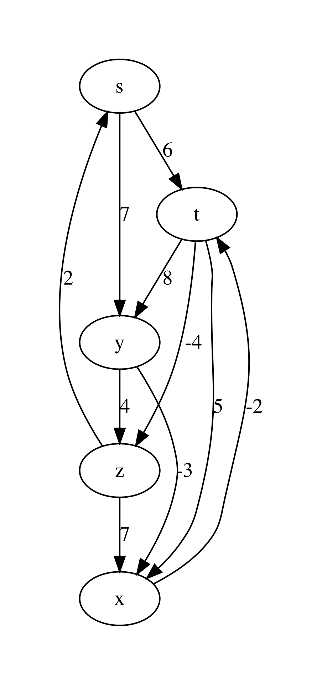
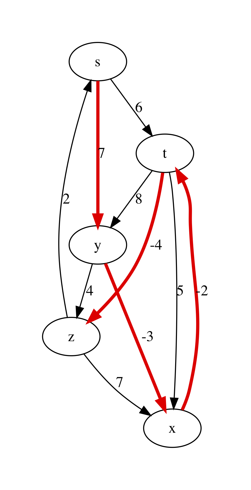
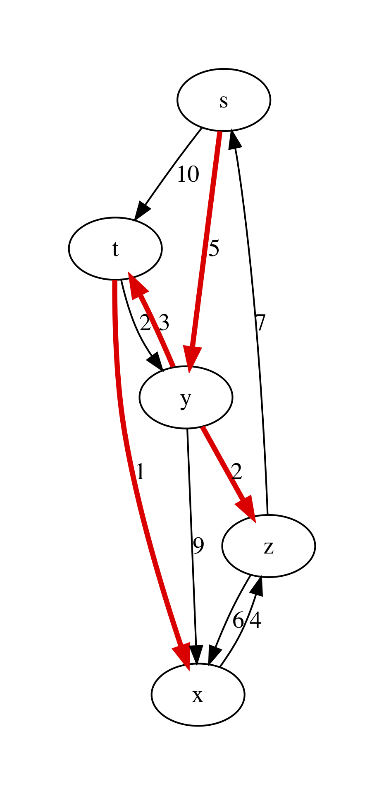

.. -*- mode: rst -*-

.. _paths:

Single-Source Shortest Paths
============================

* File: ``Paths.ml``

One of the most common problems solved via graphs is *navigation* ---
finding the most efficient route from a point A to a point B,
following the map, defined by the graph (this is what is happening
when you are looking for directions on Google maps).

Weighted Graphs
---------------

To represent the navigation problem using graphs, we need to expand our definitions.

.. admonition:: Definition (Weighted directed graph)

  A directed graph :math:`G = (V, E)` is called *weighted* if it comes with a function :math:`w : E \rightarrow \mathbb{R}`, which maps each edge to some number, representing its "weight" (or "cost").

.. admonition:: Definition (A path in a graph)

  A sequence of nodes :math:`p = \langle v_0, \ldots, v_k \rangle` is a *path* in a graph :math:`G`, if for any :math:`i` and :math:`i + 1`, such that :math:`v_i` and :math:`v_{i + 1}` are the two nodes in :math:`p`, :math:`(v_i, v_{i + 1}) \in G.E`. A weight of the path :math:`p` is defined as :math:`w(p) = \sum_{i=1}^{k}w(v_{i - 1}, v_i)`. 

.. admonition:: Definition (The shortest path)
                
  A path :math:`p` from a node :math:`u` to a node :math:`v` in a graph :math:`G` is the *shortest* one, if its weight is the smallest of all possible paths from :math:`u` to :math:`v` in :math:`G`. If no path from :math:`u` to :math:`v` exists, the shortest path's weight is taken to be :math:`\infty`.

In our example with navigation via Google Maps, a weight of a path correspond to the time of a certain connection. Choosing the shortest path corresponds to choosing a fastest route.

Some Properties of Paths
------------------------

The following properties hold of shortest paths in directed weighted graphs, and are easy to prove:

* A subpath of a shortest path is a shortest path between the corresponding nodes.
* The shortest graph always contains each node at most once. 

The definition of a shortest path also applies in the case of negative weights. However, it makes no sense in the presence of cycles with negative weight (explain, why).

Representing Shortest Paths
---------------------------

Given a *source* node :math:`s` in a graph :math:`G`, we are interested in computing the shortest paths to all nodes of :math:`G` that are reachable from :math:`s`. This problem is known ad SSSP --- *Single-Source Shortest Paths*.

While discovering shortest paths, we will be representing the current knowledge about paths from :math:`s` to other nodes by building a *predecessor tree* ``pred_tree`` . It can be represented via a hash table, in which each node :math:`v` of the graph (serving as a key) will be pointing to the current predecessor node on a path from :math:`s` to :math:`v` or ``None``, if no path is built yet. As we keep building the shortest paths, this information can change.

The actual paths from :math:`s` to any node :math:`v` can be reconstructing by traversing the branches of the predecessor tree bottom-up and then reversing the obtained lists.

It is also convenient to store the distance from the search root :math:`s` to all nodes :math:`v` is a separate structure, which we will call distance table (``dist_table``). Initially ``dist_table`` stores ``0`` for :math:`s` and :math:`\infty` for all other nodes. This information will evolve with the progression of the algorithms.

In our implementation of graphs, we can encoding the weights of edges by piggy-backing on the labels for the graph edges. Therefore, we will need the following auxiliary definitions::

 open ReadingFiles
 open BST
 open BinarySearchTree
 include Reachability

 (* Get node payload for AL graph *)
 let get_ag_node_payload ag n = 
   let open AdjacencyGraphs in
   List.find (fun (x, _) -> x = n) !(ag.node_payloads) |> snd

 (* Get edge label for AL graph *)
 let get_ag_edge_label ag s d = 
   let open AdjacencyGraphs in
   List.find (fun ((x, y), _) -> s = x && y = d) 
     !(ag.edge_labels) |> snd

 (* Get node payload for linked graph *)
 let get_linked_node_payload g n = 
   let open LinkedGraphs in
   let node = NodeTable.get g.node_map n |> get_exn in
   !(node.value)

 (* Get edge label for AL-graph *)
 let get_linked_edge_label g s d = 
   let open LinkedGraphs in
   EdgeTable.get g.edge_labels (s, d) |> get_exn

The following modified function helps to visualise graphs with weights::

 let graphviz_with_weights g out = 
   let open AdjacencyGraphs in
   let ag = LinkedGraphs.to_adjacency_graph g in
   let vattrib = get_ag_node_payload ag in
   let eattrib (s, d) = 
     let l = get_ag_edge_label ag s d |> string_of_int in
     Printf.sprintf "[label=\"%s\", weight=\"%s\"]" l l
   in
   let s = graphviz_string_of_graph "digraph" " -> " 
       vattrib eattrib ag in
   write_string_to_file out s

For instance, consider the following example graph with named nodes and integer weights on its edges::

 let bf_example_nodes = [|"s"; "t"; "y"; "x"; "z"|]

 let bf_example_edges = 
   [(0, 1); (0, 2); (1, 2); (1, 3); (1, 4); (2, 3); (2, 4); (3, 1); (4, 0); (4, 3)]

 let bf_example_labels = 
   [(0, 1,  6); (0, 2,  7); (1, 2,  8); (1, 3,  5); (1, 4, -4); 
    (2, 3, -3); (2, 4,  4); (3, 1, -2); (4, 0,  2); (4, 3,  7)]

 let example_graph_bf = 
   read_graph_and_payloads 5 bf_example_nodes
     bf_example_edges bf_example_labels

Upon rendering it via ``graphviz_with_weights``, we obtain the following plot:

Representing Distance
---------------------

When we only start looking for the paths, we don't know what is the
distance from :math:`s` to other nodes, hence we need to
over-approximate. For this we are going to be using the following
"wrapper" type ``Distance.dist``, which allows for representing
infinite distances::

 module Distance = struct

 type dist = 
     | Finite of int
     | Infinity

 let (<) d1 d2 = match (d1, d2) with
   | Infinity, _ -> false 
   | Finite _, Infinity -> true
   | Finite x, Finite y -> x < y

 let (<=) d1 d2 = d1 < d2 || d1 = d2
 let (>) d1 d2 = not (d1 <= d2)
 let (>=) d1 d2 = not (d1 < d2)

 let (+) d1 d2 = match (d1, d2) with
   | Infinity, _ -> Infinity
   | _, Infinity -> Infinity
   | Finite x, Finite y -> Finite (x + y)

 let int_of_dist d = match d with
   | Infinity -> raise (Failure "Cannot convert infinity to integer!")
   | Finite n -> n

 end

Notice that we specifically arrange it as a separate module, in order to avoid clashes between the overloaded comparison operators and those defined automatically by OCaml (should we have relied on the latter ones, our further implementation would be incorrect!).

Initialisation and Relaxation
-----------------------------

All SSSP algorithms rely on the two main operations: 

* Initialising the predecessor tree and the distance table, and
* *Relaxing* the path information about two nodes, by accounting for a found smalle distance between them.

The first operation is implemented as follows. It takes a graph ``g`` (in a linked form), a source node ``s`` and returns the weight function ``w``, the predecessor tree and the distance table::

 let initialise_single_source g s = 
   let open Distance in
   let n = v_size g in 
   let dist_table = mk_new_table n in
   let prev_tree  = mk_new_table n in
   for i = 0 to n - 1 do
     insert dist_table i Infinity;
   done;
   insert dist_table s (Finite 0);
   let w = get_linked_edge_label g in
   (w, dist_table, prev_tree)

The second operation relies on the auxiliary function ``dist``::

 (* Get distance from the table *)
 let dist dist_table u =
   let open NodeTable in 
   get_exn @@ get dist_table u

The function ``relax dist_table prev_tree w u v`` acts in the
assumption that ``dist_table`` and ``prev_tree`` record some partial
information about the over-approximated shortest paths from ``s`` to
both ``u`` and ``v``. It then checks if this information can benefit
by taking the weight of the edge ``(u, v)`` into the account. If it is
the case, both the distance and the predecessor information is
updated::

 (* Relax the distance between u and v *)
 let relax dist_table prev_tree w u v = 
   let open Distance in
   let vud = dist dist_table u + (Finite (w u v)) in 
   if dist dist_table v > vud
   then begin
     insert dist_table v vud;
     insert prev_tree v u
   end

The relaxation procedure satisfies the following property, which is crucial for the correctness of many SSSP algorithms:

.. admonition:: Property (Path relaxation)

  If :math:`p = \langle v_0, v_1, \ldots, v_k \rangle` is a shortest
  path from :math:`s = v_0` to :math:`v_k`, and we relax the edges of
  :math:`p` in order :math:`(v_0, v_1)`, :math:`(v_1, v_2)`, etc. Then
  the distance to :math:`v_k`, as recorded in the distance table is
  the weight of the path :math:`p`. In other words, any path of the
  length :math:`k` or less can be discovered in :math:`k` relaxations
  of the entire set :math:`E` of edges.

Bellman-Ford Algorithm
----------------------

The **Bellman-Ford algorithm** builds on the path relaxation property.
It is powered by observation that if ``n`` is the size of the set of
nodes of the graph, and shortest path will have ``n`` or lest nodes in
it (otherwise there are repetitions, which contradicts the fact that
this is a shortest path). Therefore, having done ``n`` relaxations of
the entire set of the nodes, we can discover the shortest paths by
building the predecessor trees. This is doen as follows::

 let bellman_ford g s = 
   let open Distance in 
   let (w, d, p) = initialise_single_source g s in
   let all_edges = elements g.edges in 

   for i = 0 to v_size g - 1 do 
     List.iter (fun (u, v) -> relax d p w u v) all_edges 
   done;

   (* Check for negative cycles *)
   let rec check_neg_cycles es = match es with
     | [] -> true
     | (u, v) :: t ->
       if dist d v > dist d u + (Finite (w u v))
       then false
       else check_neg_cycles t 
   in

   ((p, d), check_neg_cycles all_edges)

The algorithm works also on graphs with negative-weighted edges. As a bonus, it discovers whether the graph has *negative cycles*, in which case there is no shortest path (or its weight is :math:`-\infty`). This is done by the call to ``check_neg_cycles``, which checks if further relaxations can reduce some distances further (which would be impossible if there were no cycles).

Notice that ``bellman_ford`` relies on the ``dist`` data types from the ``Distance`` module to operate with possibly infinite weights.

**Question:** What is a complexity of ``bellman_ford`` in terms of ``g.V`` and ``g.E``?

Rendering Minimal Paths
-----------------------

We can visualise the result of the algorithm by using the following function rendering a suitable GraphViz representation::

 let graphviz_with_min_paths path_calculuator g s out = 
   let p = path_calculuator g s in 
   let attrib (u, v) = 
     let l = get_linked_edge_label g u v |> string_of_int in
     match get p v with
     | Some z when u = z -> 
       Printf.sprintf "[label=\"%s\", color=red,penwidth=3.0]" l
     | _ -> 
       Printf.sprintf "[label=\"%s\"]" l
   in
   let ag = LinkedGraphs.to_adjacency_graph g in
   let s = graphviz_string_of_graph "digraph" " -> " 
       (get_linked_node_payload g) attrib ag in
   write_string_to_file out s

 let graphviz_with_bellman_ford = 
   let pc g s = bellman_ford g s |> fst |> fst in
   graphviz_with_min_paths pc

Running ``graphviz_with_bellman_ford example_graph_bf 0 "bf.dot"`` produces the following plot:

Dijkstra's Algorithm
--------------------

**Dijkstra's algorithm** has a better complexity that Bellman-Fort but only works on graphs with non-negative edge weights. It is a *greedy* algorithm, that gradually explores the surroundings of the source node :math:`s`, looking for the next node that will provide for the shortest paths. In doing so, it explores each node and edge just once, relying on the ongoing relaxation, recomputing the shortest paths as it goes::

 (* Extract minimal distance in O(|remaining|) *)
 let extract_min_dist dist_table remaining = 
   let open Distance in
   let res = ref None in
   let d = ref Infinity in
   List.iter (fun i ->
       let di = dist dist_table i in
       if di <= !d
       then begin
         res := Some i;
         d := di
       end) !remaining;

   match !res with
   | None -> None
   | Some i -> begin
       remaining := List.filter (fun j -> i <> j) !remaining;
       !res
     end

 let dijkstra g s = 
   let (w, d, p) = initialise_single_source g s in

   (* Make queue of remaining uninspected nodes *)
   let q = ref (iota (v_size g - 1)) in
   while !q <> [] do
     let u = extract_min_dist d q |> get_exn in
     let adj = get_succ g u in
     List.iter (fun v -> relax d p w u v) adj
   done;
   (p, d)

**Question:** The complexity of out implementation of ``dijkstra`` is
 :math:`O(|g.V|^2 + |g.E|)`. Can you explain it?

Dijkstra crucially relies on all weights on edges being
*non-negative*. This way, adding an edge to a path can never make a it
shorter (which is not the case with negative edges). This is why
taking the shortest candidate edge (local optimality) always ends up
being correct (global optimality). If that is not the case, the
"frontier" of candidate edges does not send the right signals; a cheap
edge might lure you down a path with positive weights while an
expensive one hides a path with negative weights.

We can experiment with Dijkstra's algorithm on the following graph::

 let graphviz_with_dijkstra = 
   let pc g s = dijkstra g s |> fst in
   graphviz_with_min_paths pc

 let dijkstra_example_nodes = 
   [|"s"; "t"; "y"; "x"; "z"|]

 let dijkstra_example_edges = 
   [ (0, 1); (0, 2); (1, 2); (1, 3); (2, 1); (2, 3); (2, 4); (3, 4); (4, 0); (4, 3)]

 let dijkstra_example_labels = 
   [(0, 1, 10); (0, 2, 5); (1, 2, 2); (1, 3, 1); (2, 1, 3); 
    (2, 3, 9); (2, 4, 2); (3, 4, 4); (4, 0, 7); (4, 3, 6)]

 let example_graph_dijkstra = 
   read_graph_and_payloads 5 dijkstra_example_nodes
     dijkstra_example_edges dijkstra_example_labels

This results in the following plot:

Testing Shortest-Path Algorithms
--------------------------------

The following functions help to retrieve the shortest paths from the predecessor tree and also compute the weight of a path::

 let get_shortest_path p s u = 
   let rec walk acc v = match get p v with
     | None -> acc
     | Some x -> walk ((x, v) :: acc) x
   in
   let res = walk [] u in
   if u = s || 
      res <> [] && (List.hd res |> get_exn |> fst = s)
   then Some res
   else None

 let rec get_path_weigth g path = match path with
   | (u, v) :: t -> 
     let w = get_linked_edge_label g u v in 
     w + get_path_weigth g t
   | _ -> 0

Let us now distil some properties of the shortest paths in a form of a test. We will test an SSSP solution for the two given graphs by relying on the reachability facts derived before. Specifically, we will check that

1. A shortest path is a connected path.
2. The distance table correctly records the shortest path's weight.
3. Each edge of a shortest path is an edge of a graph.
4. A shortest path from ``s`` exists for each node reachable from ``s``.
5. A shortest path from ``s`` to ``u`` is no longer than an arbitrary path from ``s`` to ``u``.

This is covered by the following tests::

 open LinkedGraphs
 open NodeTable

 (*

 Test the following facts:

 * p - predecessor tree
 * d - distance table
 * g - the graph
 * s - source node
 * u - destination node

 *)

 (* 1. Path is connected *)
 let test_path_connected p d g s u = 
   match get_shortest_path p s u with
   | None -> true
   | Some path ->
     let rec walk p = match p with
       | (u, v) :: (x, y) :: t ->
         v = x && walk ((x, y) :: t )
       | _ -> true
     in
     walk path

 (* 2. Path's weight is correctly recorded *)
 let test_path_weight p d g s u =
   match get_shortest_path p s u with
   | None -> true
   | Some path ->
     let w1 = get_path_weigth g path in 
     let w2 = get_exn @@ get d u |> Distance.int_of_dist in
     w1 = w2

 (* 3. Has all edges *)    
 let test_that_is_path_graph p d g s u =
   match get_shortest_path p s u with
   | None -> true
   | Some path ->
     let all_edges = g.edges |> elements in
     List.for_all (fun e -> List.mem e all_edges) path 

 (* 4. Exists for any reachable node *)
 let test_reachable_hence_has_path p d g s u = 
   if is_reachable g s u 
   then get_shortest_path p s u <> None
   else true

 (* 5. And is the shortest *)
 let test_shortest_is_shorter p d g s u = 
   match reachable g s u with
   | None -> true
   | Some p1 ->
     match get_shortest_path p s u with
     | None -> false
     | Some p2 ->
       let w1 = get_path_weigth g p1 in 
       let w2 = get_path_weigth g p2 in 
       w2 <= w1

 (*  Main testing function  *)
 let test_sssp algo g = 
   let all_nodes = get_nodes g in
   List.iter (fun u ->
       List.iter (fun v ->
           let (p, d) = algo g u in
           assert (test_path_connected p d g u v);
           assert (test_path_weight p d g u v);
           assert (test_that_is_path_graph p d g u v);
           assert (test_reachable_hence_has_path p d g u v);
           assert (test_shortest_is_shorter p d g u v);
         ) all_nodes) all_nodes;
   true

 (*  Testing Bellman-Ford  *)

 let%test "Bellman-Ford-1" = 
   let algo g s = bellman_ford g s |> fst in
   test_sssp algo example_graph_bf

 (* BF also works on Dijkstra-suitable graphs *)
 let%test "Bellman-Ford-2" = 
   let algo g s = bellman_ford g s |> fst in
   test_sssp algo example_graph_dijkstra

 (*  Testing Dijkstra  *)

 let%test "Dijkstra" = 
   test_sssp dijkstra example_graph_dijkstra
