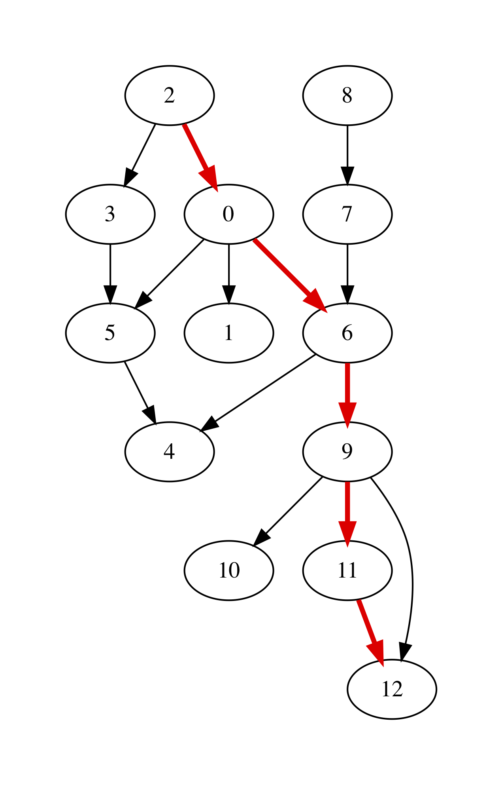
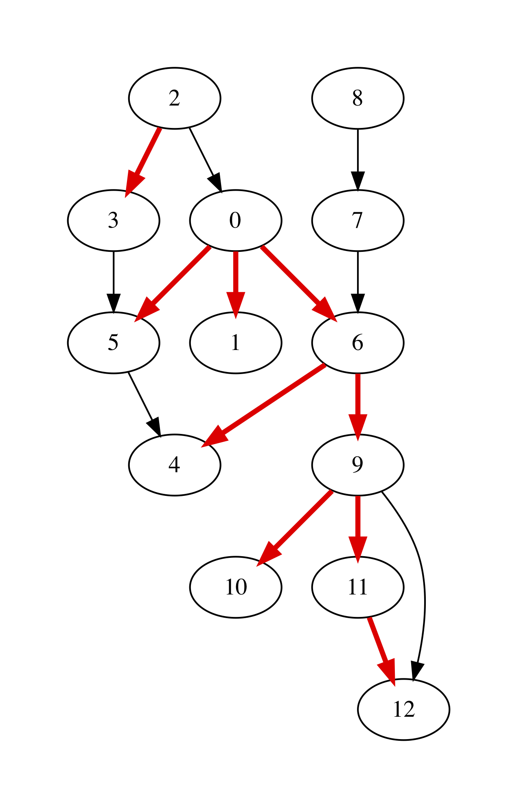
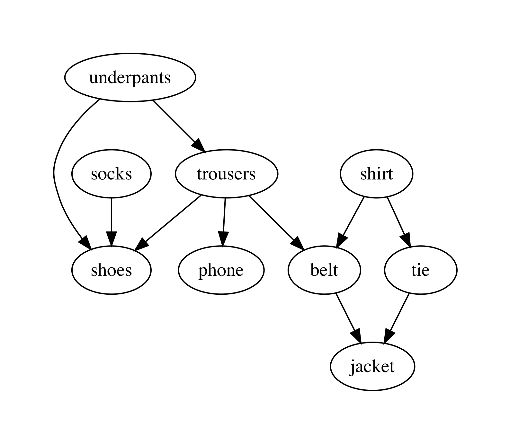

.. -*- mode: rst -*-

.. _reachability:

Reachability and Graph Traversals
=================================

* File: ``Reachability.ml``

Having the graphs defined, let us now do something interesting with
them. In this chapter, we will be looking at the questions of
*reachability* between nodes, as allowed by a given graph's topology.
In all algorithms, we will be relying on the linked representation::

 open Util
 open ReadingFiles
 include Graphs
 open LinkedGraphs

Checking Reachability in a Graph
--------------------------------

Given a graph ``g`` and two its nodes ``init`` and ``final``, let us
define a procedure that determines whether we can get from ``init`` to
``final`` by following the edges of ``g``, and if so, return the list
of those edges::

 let reachable g init final = 
   let rec walk path visited n = 
     if n = final 
     then Some path
     else if List.mem n visited 
     then None
     else
       (* Try successors *)
       let node = get_node g n in
       let successors = get_next node in
       let visited' = n :: visited in
       let rec iter = function
         | [] -> None
         | h :: t -> 
           let path' = (n, h) :: path in
           match walk path' visited' h with
           | Some p -> Some p
           | None -> iter t
       in
       iter successors
   in
   match walk [] [] init with
   | Some p -> Some (List.rev p)
   | _ -> None

The implementation of ``reachable`` employs the backtracking technique
(see the Chapter :ref:`week-09-backtracking`), which is implemented by
means of an interplay of the two functions: ``walk`` and ``iter``. The
former also checks that we do not hit a *cycle* in a graph, hence it
contains the list of ``visited`` nodes. Finally, the ``path``
accumulates the edges (in a reversed) on the way to destination, and
is returned at the end, if the path is found.

**Question:** What is the complexity of ``reachable`` in terms of sizes of ``g.V`` and ``g.E``. What would it be if we don't take the complexity of ``List.mem n visited`` into the account?

We can define the reachability predicate as follows::

 let is_reachable g init final = 
   reachable g init final <> None

Testing Reachability
--------------------

The following are the tests for the specific two graphs we have seen, designed with a human intuition in mind::

 open Reachability

 let%test _ =  
   let g = LinkedGraphs.parse_linked_int_graph small_graph_shape in
   (* True statements *)
   assert (is_reachable g 0 5);
   assert (is_reachable g 5 1);
   assert (is_reachable g 5 5);

   (* False statements *)
   assert (not (is_reachable g 4 5));
   true

 let%test _ =  
   let g = LinkedGraphs.parse_linked_int_graph medium_graph_shape in
   (* True statements *)
   assert (is_reachable g 2 4);
   assert (is_reachable g 8 12);
   assert (is_reachable g 0 10);

   (* False statements *)
   assert (not (is_reachable g 5 9));
   assert (not (is_reachable g 11 7));
   true

Rendering Paths in a Graph
--------------------------

We can use the same machinery for interactive with GraphViz to highlight the reachable paths in a graph::

 let bold_edge = "[color=red,penwidth=3.0]"

 let graphviz_with_path g init final out = 
   let r = reachable g init final in 
   let attrib (s, d) = match r with
     | None -> ""
     | Some p -> 
       if List.mem (s, d) p 
       then bold_edge
       else ""
   in
   let ag = LinkedGraphs.to_adjacency_graph g in
   let s = graphviz_string_of_graph "digraph" " -> " 
       string_of_int attrib ag in
   write_string_to_file out s

For instance, taking the ``g`` to be the medium-size graph from the
end of the previous chapter, we can render the result of
``graphviz_with_path g 2 12 "filename.out"`` to the following picture:

Depth-First Traversal
---------------------

It is possible to split graph into a set of trees with dedicated roots, so that each subtree is reachable from its root. One way to do it is using the Depth-First Search (DFS) procedure.

The procedure is similar to reachability checking implemented above, but employs a more efficient way to detect cycles via the "colouring" technique. In essence, it maintains an additional hash table, assigning the colors as attributes to the nodes, to indicate whether the have not yet, are being, or have been fully processed::

  open NodeTable 

  type color = White | Gray | Black

The main procedure is again implemented via back-tracking::

  let rec dfs g = 
    let color_map = mk_new_table (v_size g) in
    let tree_map = mk_new_table (v_size g) in
    let time_map = mk_new_table (v_size g) in
    let has_cycles = ref false in
    let roots = ref [] in
    let all_nodes = get_nodes g in

    (* Make all nodes white *)
    List.iter (fun n -> insert color_map n White) all_nodes;
    (* Insert all nodes to the tree *)
    List.iter (fun n -> insert tree_map n []) all_nodes;

    let time = ref 0 in 

    let rec dfs_visit u = 
      time := !time + 1;
      let u_in = !time in
      insert color_map u Gray;
      get_succ g u |> List.iter (fun v -> 
          let v_color = get_exn @@ get color_map v in
          if v_color = White
          then begin
            let siblings = get_exn @@ get tree_map u in
            insert tree_map u (v :: siblings);
            dfs_visit v
          end 
          else if v_color = Gray 
          then has_cycles := true) ;
      insert color_map u Black;
      time := !time + 1;
      let u_out = !time in
      insert time_map u (u_in, u_out)
    in

    List.iter (fun n -> 
        if get_exn @@ get color_map n = White
        then begin
          (* Record roots *)
          roots := n :: !roots;
          dfs_visit n
        end) 
      all_nodes;

      (!roots, tree_map, time_map, !has_cycles)  

It starts by assigning all nodes the ``White`` colour, and then
creates an empty tree for each node. It also keeps track of ``time``
(a natural number) of "entering" and "exiting" the node. The "roots"
of the trees are all collected in the mutable list ``roots``, and the
variable ``has_cycles`` determines whether a cycle has been witnessed.

As the result, the procedure returns the list of roots, the hash-map
that stores the tree relation between nodes in the DFS traversal from
the roots, the pair of timestamps when a node has been visited and the
boolean value indicating whether a graph has cycles. 

**Question:** How would you characterise the period during which a node is painted ``Gray`` during the DFS traversal?

**Question:** If ``u`` is a parent of ``v`` in a DFS-tree, what is the
relation between their timestamps?

We can render the result of DFS via the following procedure, using the
tree to retrieve the edge attributes::

  (* Visualise with DFS *)
  let graphviz_with_dfs g out = 
  let (_, tree, _, _) = dfs g in 
  let eattrib (s, d) = match get tree s with
    | None -> ""
    | Some p -> 
      if List.mem d p 
      then bold_edge
      else ""
  in
  let ag = LinkedGraphs.to_adjacency_graph g in
  let s = graphviz_string_of_graph "digraph" " -> " 
      string_of_int eattrib ag in
  write_string_to_file out s

For instance, for our working graph we get the following image,
indicating `four` trees, rooted at nodes 0, 2, 7, and 8, correspondingly (the
last two trees only have one node each, hence are difficult to spot):

The reason why we ended up with four trees is due to the order in which DFS was
choosing nodes to start from.

DFS and Reachability
--------------------

Let us define the following procedure, checking the reachability via DFS::

  let is_reachable_via_dfs g init final = 
    let (roots, tree, _, _) = dfs g in
    let rec walk n = 
      if n = final then true
      else 
        get tree n |> 
        get_exn |>
        List.exists (fun v -> walk v)
    in
    if List.mem init roots 
    then walk init
    else false

**Question:** Is initial notion of reachability equivalent to DFS-reachability?

The differences aside, we can still use it to teste DFS using the following observations::

 let test_dfs g = 
   let all_nodes = LinkedGraphs.get_nodes g in 
   let (dfs_roots, _, _, _) = GraphDFS.dfs g in

   (* Any node DFS-reachable from a root r is reachable from r *)
   let fact1 = 
     List.for_all (fun u ->
         List.for_all (fun v ->
             if GraphDFS.is_reachable_via_dfs g u v
             then is_reachable g u v
             else true) all_nodes) dfs_roots
   in

   (* Any node is reachable from some root r *)
   let fact2 = 
     List.for_all (fun u ->
         List.exists 
           (fun r -> GraphDFS.is_reachable_via_dfs g r u)
           dfs_roots)
       all_nodes in

   fact1 && fact2

DFS and Cycle Detection
-----------------------

As a byproduct, our DFS has detected if a given graph has a cycle in it. We can now test it as follows::

 let%test _ =  
   let g = LinkedGraphs.parse_linked_int_graph small_graph_shape in
   let (_, _, _, c) = GraphDFS.dfs g in
   c

 let%test _ =  
   let g = LinkedGraphs.parse_linked_int_graph medium_graph_shape in
   let (_, _, _, c) = GraphDFS.dfs g in
   not c

Topological Sort
----------------

Assume our graph has no cycles (i.e., it is a so-called *Directed
Acyclic Graph*, or *DAG*). In this case it is possible to enumerate
its nodes (i.e., put them to an ordered list) in a way that all edges
will be going from nodes "left-to-right". This operation is called
*Topological Sort* and is very useful for processing dependencies in
an order, implicitly imposed by a graph.

As an example of Topological Sort, you can think of compiling multiple
OCaml files. Dependencies between files introduce a DAG (as there are
no cycles), but the compiler need to process them in an order so that
the dependant files would be compiled after their dependencies. This
is where Topological Sort comes to the rescue.

Another (somewhat more lively) example is a professor who dresses
every morning, having the following dependencies between his clothes
to put on:

The graph with those dependencies can be encoded as follows::
  
 let clothes_edges = [
   (0, 8);
   (0, 2);
   (8, 2);
   (8, 1);
   (8, 7);
   (3, 7);
   (3, 4);
   (4, 5);
   (7, 5);
   (6, 2);
 ]

while the payloads (i.e., the items of clothes) are given by the following array::

 let clothes = 
   [|  
     "underpants";
     "phone";
     "shoes";
     "shirt";
     "tie";
     "jacket";
     "socks";
     "belt";
     "trousers";
   |]

We can now instantiate the linked-structure-based graph via the following function::

 let read_graph_and_payloads size nvalue elist elabels = 
   let open AdjacencyGraphs in 
   let g = mk_graph size in
   for i = 0 to g.size - 1 do
     set_payload g i nvalue.(i) 
   done;  
   List.iter (fun (s, d) -> add_edge g s d) elist;
   List.iter (fun (s, d, l) -> set_edge_label g s d l) elabels;
   LinkedGraphs.from_simple_adjacency_graph g

 let clothes_graph = 
   read_graph_and_payloads 9 clothes clothes_edges 
     ([] : (int * int * unit) list)

The image can produced by the following procedure::

 let graphviz_with_payload g values out = 
   let eattrib e = "" in
   let vattrib n = values.(n) in
   let ag = LinkedGraphs.to_adjacency_graph g in
   let s = graphviz_string_of_graph "digraph" " -> " 
       vattrib eattrib ag in
   write_string_to_file out s

The procedure of the topological sort exploits the time-stamps recorded during DFS. The intuition is as follows: in the absence of cycles, the nodes with the later "exit" timestamp ``u_out`` are the "topological predecessors" of those with smaller timestamps, and, hence, the former should be put earlier in the list. Another way to think of it is that DFS introduces a "parenthesised structure"  on the subtrees of the graph, and the nodes up the tree have exit timestamps, corresponding to a parenthesis more "to the right".

The implementation of the topological sort, thus, simply sorts the nodes in the decreasing order of the exit timestamp::

 module TopologicalSort = struct

   open NodeTable 

   let get_last_time m n = get_exn @@ get m n

   let topo_sort g = 
     let (_, _, time_map, _) = GraphDFS.dfs g in
     get_nodes g |>
     List.sort (fun n1 n2 ->
         let (_, t1) = get_last_time time_map n1 in
         let (_, t2) = get_last_time time_map n2 in
         if t1 < t2 then 1
         else if t1 > t2 then -1
         else 0)

 end

For the graph of professor clothes, the topological sort returns the following sequence (which is coherent with the picture above)::

 utop # let l = TopologicalSort.topo_sort clothes_graph;;
 utop # List.iter (fun i -> Printf.printf "%s\n" clothes.(i)) l;;

 socks
 shirt
 tie
 underpants
 trousers
 belt
 jacket
 phone
 shoes

Testing Topological Sort
------------------------

A simple property to check of a topological sort is that for all subsequently positioned nodes ``(u, v)`` in its result, the node ``u`` is not reachable from ``v``::

 let rec all_pairs ls = match ls with
   | [] -> []
   | _ :: [] -> []
   | h1 :: h2 :: t -> (h1, h2) :: (all_pairs (h2 :: t))    

 let%test _ =  
   let g = LinkedGraphs.parse_linked_int_graph medium_graph_shape in
   let pairs = TopologicalSort.topo_sort g |> all_pairs in
   List.for_all (fun (s, d) -> not (is_reachable g d s)) pairs

 let%test _ =  
   let g = clothes_graph in
   let pairs = TopologicalSort.topo_sort g |> all_pairs in
   List.for_all (fun (s, d) -> not (is_reachable g d s)) pairs
