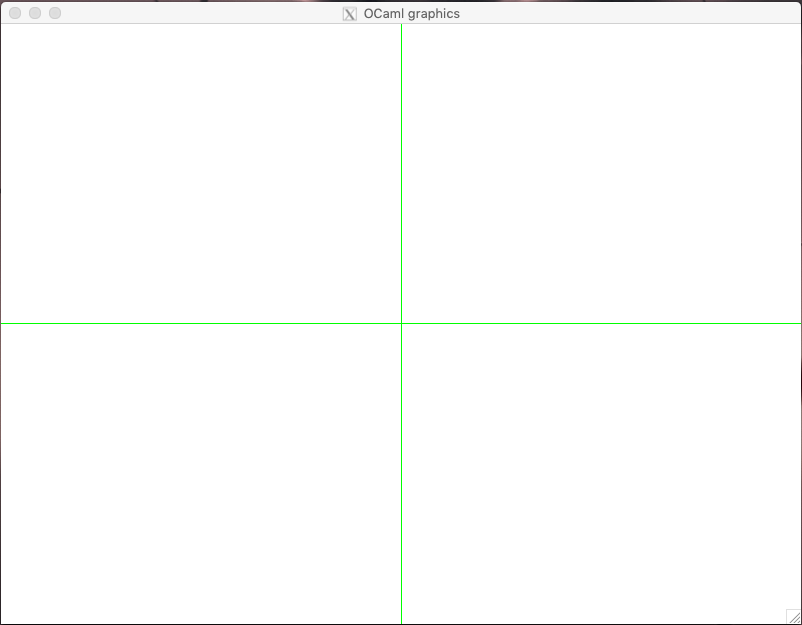

.. -*- mode: rst -*-

.. _geometry:

Basics of Computational Geometry
================================

Computational geometry (CG) is a sub-area of computer science that
studies data structures and algorithms for solving geometric problems,
which are common in computer vision, metallurgy, manufacturing,
forestry, and navigation.

Those problem as we know them from the high school, often have a
"continuous" nature, so the main task of computational geometry is to
reduce them to familiar abstractions, in terms of the data structures
that we have already studies. In this last chapter of this course, we
will take a look at some basic constructions of CG and will learn how
to represent them graphically, as well as how to compute some of their
intrinsic properties.

Working with graphics in OCaml
------------------------------

* File ``GraphicUtil.ml``

There is not much fun in talking about geometric problems without being able
to visualise them.

To render the shapes and the results of the algorithms, we will employ
OCaml's ``Graphics`` package, which provides very primitive (yet
sufficient for our needs) support for rendering two-dimensional
shapes.

The detailed instructions on how to install and run the functions from
the ``Graphics`` package are given in `this demo repository
<https://github.com/ilyasergey/ocaml-graphics-demo>`_.

It is quite easy to start working with graphics. For instance running the following command opens a window that is 800 pixels wide and 600 tall::

 open Graphics;;

 open_graph " 800x600" 

The axes of the window start in the bottom left corner, and go right
and up. It is more convenient to have our layout "centered" around the
actual center of the image, so we could make us of the negative parts
of the axes as well. This is why, when rendering our figures, we will
always shift them with respect to a certain origin, which we choose to
be the center of our ``800x600`` pixels window::

 let origin = (400, 300)

 let go_to_origin _ =
   let x = fst origin in
   let y = snd origin in
   moveto x y;
   set_color black

In the function ``go_to_origin``, the command ``moveto`` transfeers the "invisible" pointer to the origin, and sets the default drawing color to be ``Graphics.black`` (other colours are possible and can be set up using the RGB scheme).

Using the following function we can draw a "grid" of the two axes, to help the orientation::

 let draw_axes _ =
   let x = fst origin in
   let y = snd origin in
   set_color green;
   moveto 0 y;
   lineto (x * 2) y;
   moveto x 0;
   lineto x (y * 2);
   moveto x y;
   set_color black

Using it, we can create a new window with the axes already drawn::

 let mk_screen _ = 
   open_graph " 800x600";
   draw_axes ()

Finally, we can remove everything but the axes by running the following function::
    
 let clear_screen _ =
   clear_graph ();
   draw_axes ()
