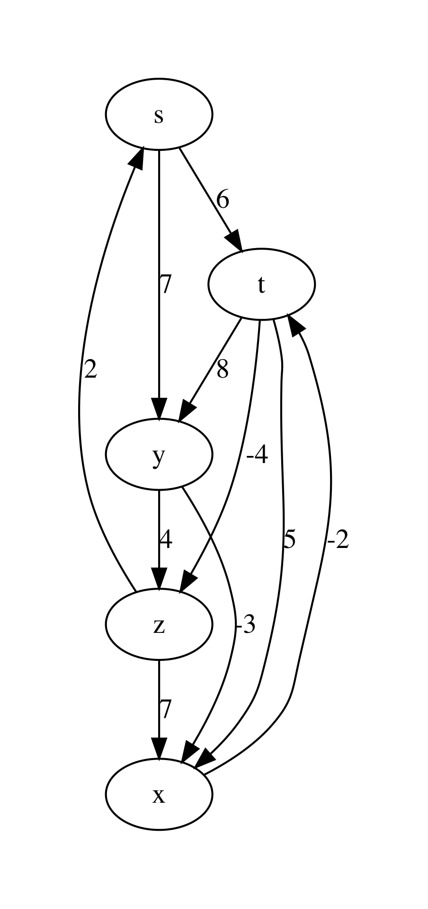

.. -*- mode: rst -*-

.. _paths:

Single-Source Shortest Paths
============================

https://github.com/ilyasergey/ysc2229-part-two/blob/master/lib/week_13_Paths.ml

One of the most common problems solved via graphs is *navigation* --- finding the most efficient route from a point A to a point B, following the map, defined by the graph (this is what is happening when you are looking for directions on Google maps). 

Weighted Graphs
---------------

To represent the navigation problem using graphs, we need to expand our definitions.

.. admonition:: Definition (Weighted directed graph)

  A directed graph :math:`G = (V, E)` is called *weighted* if it comes with a function :math:`w : E \rightarrow \mathbb{R}`, which maps each edge to some number, representing its "weight" (or "cost").

.. admonition:: Definition (A path in a graph)

  A sequence of nodes :math:`p = \langle v_0, \ldots, v_k \rangle` is a *path* in a graph :math:`G`, if for any :math:`i` and :math:`i + 1`, such that :math:`v_i` and :math:`v_{i + 1}` are the two nodes in :math:`p`, :math:`(v_i, v_{i + 1}) \in G.E`. A weight of the path :math:`p` is defined as :math:`w(p) = \sum_{i=1}^{k}w(v_{i - 1}, v_i)`. 

.. admonition:: Definition (The shortest path)
                
  A path :math:`p` from a node :math:`u` to a node :math:`v` in a graph :math:`G` is the *shortest* one, if its weight is the smallest of all possible paths from :math:`u` to :math:`v` in :math:`G`. If no path from :math:`u` to :math:`v` exists, the shortest path's weight is taken to be :math:`\infty`.

In our example with navigation via Google Maps, a weight of a path correspond to the time of a certain connection. Choosing the shortest path corresponds to choosing a fastest route.

Some Properties of Paths
------------------------

The following properties hold of shortest paths in directed weighted graphs, and are easy to prove:

* A subpath of a shortest path is a shortest path between the corresponding nodes.
* The shortest graph always contains each node at most once. 

The definition of a shortest path also applies in the case of negative weights. However, it makes no sense in the presence of cycles with negative weight (explain, why).

Representing Shortest Paths
---------------------------

Given a *source* node :math:`s` in a graph :math:`G`, we are interested in computing the shortest paths to all nodes of :math:`G` that are reachable from :math:`s`. This problem is known ad SSSP --- *Single-Source Shortest Paths*.

While discovering shortest paths, we will be representing the current knowledge about paths from :math:`s` to other nodes by building a *predecessor tree* ``pred_tree`` . It can be represented via a hash table, in which each node :math:`v` of the graph (serving as a key) will be pointing to the current predecessor node on a path from :math:`s` to :math:`v` or ``None``, if no path is built yet. As we keep building the shortest paths, this information can change.

The actual paths from :math:`s` to any node :math:`v` can be reconstructing by traversing the branches of the predecessor tree bottom-up and then reversing the obtained lists.

It is also convenient to store the distance from the search root :math:`s` to all nodes :math:`v` is a separate structure, which we will call distance table (``dist_table``). Initially ``dist_table`` stores ``0`` for :math:`s` and :math:`\infty` for all other nodes. This information will evolve with the progression of the algorithms.

In our implementation of graphs, we can encoding the weights of edges by piggy-backing on the labels for the graph edges. Therefore, we will need the following auxiliary definitions::

 open Core_kernel
 open Week_12_Graphs
 open Week_13_Reachability
 open Week_12_BST
 open BinarySearchTree

 (* Get node payload for AL graph *)
 let get_ag_node_payload ag n = 
   let open AdjacencyGraphs in
   List.find_exn !(ag.node_payloads) 
     ~f:(fun (x, _) -> x = n) |> snd

 (* Get edge label for AL graph *)
 let get_ag_edge_label ag s d = 
   let open AdjacencyGraphs in
   List.find_exn !(ag.edge_labels) 
     ~f:(fun ((x, y), _) -> s = x && y = d) |> snd

 (* Get node payload for linked graph *)
 let get_linked_node_payload g n = 
   let open LinkedGraphs in
   let node = NodeTable.get g.node_map n |> Week_01.get_exn in
   !(node.value)

 (* Get edge label for AL-graph *)
 let get_linked_edge_label g s d = 
   let open LinkedGraphs in
   EdgeTable.get g.edge_labels (s, d) |> Week_01.get_exn

The following modified function helps to visualise graphs with weights::

 let graphviz_with_weights g out = 
   let open Week_10_ReadingFiles in
   let open AdjacencyGraphs in
   let ag = LinkedGraphs.to_adjacency_graph g in
   let vattrib = get_ag_node_payload ag in
   let eattrib (s, d) = 
     let l = get_ag_edge_label ag s d |> string_of_int in
     Printf.sprintf "[label=\"%s\", weight=\"%s\"]" l l
   in
   let s = graphviz_string_of_graph "digraph" " -> " 
       vattrib eattrib ag in
   write_string_to_file out s

For instance, consider the following example graph with named nodes and integer weights on its edges::

 let bf_example_nodes = [|"s"; "t"; "y"; "x"; "z"|]

 let bf_example_edges = 
   [(0, 1); (0, 2); (1, 2); (1, 3); (1, 4); (2, 3); (2, 4); (3, 1); (4, 0); (4, 3)]

 let bf_example_labels = 
   [(0, 1,  6); (0, 2,  7); (1, 2,  8); (1, 3,  5); (1, 4, -4); 
    (2, 3, -3); (2, 4,  4); (3, 1, -2); (4, 0,  2); (4, 3,  7)]

 let example_graph_bf = 
   read_graph_and_payloads 5 bf_example_nodes
     bf_example_edges bf_example_labels

Upon rendering it via ``graphviz_with_weights``, we obtain the following plot:

Initialisation and Relaxation
-----------------------------

* Initialise single source
* Relax
* Path-relaxation property

Bellman-Ford Algorithm
----------------------

TODO

Dijkstra's Algorithm
--------------------

Dijkstra relies on all weights on edges being non-negative. This way, adding an edge to a path can never make a it shorter (which is not the case with negative edges). This is why taking the shortest candidate edge (local optimality) always ends up being correct (global optimality). If that is not the case, the "frontier" of candidate edges does not send the right signals; a cheap edge might lure you down a path with positive weights while an expensive one hides a path with negative weights.

Testing Shortest-Path Algorithms
--------------------------------
