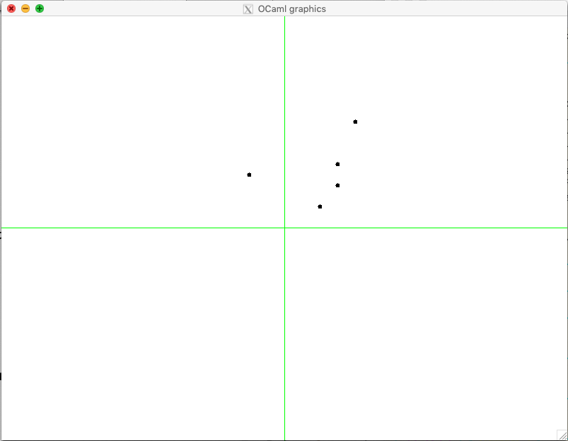

.. -*- mode: rst -*-

.. _points:

Points, Segments and their Properties
=====================================

On precision and epsilon-equality
---------------------------------

Geometrical objects in a cartesian 2-dimensional space are represented by the pairs of their coordinates :math:`x, y \in \mathbb{R}`, which can be encoded in OCaml using the data type ``float``. As the name suggests, this is the type for floating-point numbers, which can encode mathematical numbers with a finite precision. This is why ordinary equality should not be used on them. 

For instance, as a result of a numeric computation, we can obtain two numbers ``0.3333333333`` and ``0.3333333334``, both "encoding" :math:`\frac{1}{3}`, but somewhat approxiamting it in the former case and over-approxiamting it in a latter case. It is considered a usual practice to use an :math:`\varepsilon`-equality, when comparing floating-point numbers for equality. The following operations allow us to achieve this::

 let eps = 0.0000001

 let (=~=) x y = abs_float (x -. y) < eps

 let (<=~) x y = x =~= y || x < y

 let (>=~) x y = x =~= y || x > y

 let is_zero x = x =~= 0.0
 
Points on a two-dimensional plane
---------------------------------

A point is simiply a pair of two floats, wrapped to a constructor to avoid possible confusions::

 type point = Point of float * float

 let get_x (Point (x, y)) = x
 let get_y (Point (x, y)) = y

We can draw a point as a small cicrcle (let's say, with a radius of 3 pixesl) using OCaml's graphics capacities, via the following function::

 include GraphicUtil

 let draw_point ?color:(color = Graphics.black) (Point (x, y)) = 
   let open Graphics in
   let (a, b) = current_point () in
   let ix = int_of_float x + fst origin in 
   let iy = int_of_float y + snd origin in 
   moveto ix iy;
   set_color color;
   fill_circle ix iy 3;
   moveto a b;
   set_color black

Let us take some of the predefined points from this module::

 module TestPoints = struct

   let p = Point (100., 150.)
   let q = Point (-50., 75.)
   let r = Point (50., 30.)
   let s = Point (75., 60.)
   let t = Point (75., 90.)

 end

Drawing them as followins results in a picture below::

 utop # open Points;;
 utop # open TestPoints;;
 utop # mk_screen ();;
 utop # draw_point p;;
 utop # draw_point q;;
 utop # draw_point r;;
 utop # draw_point s;;
 utop # draw_point t;;

A very common operation is moving a point to a given direction, by adding ceertain x- and y-coordinates to it::

 let (++) (Point (x, y)) (dx, dy) = 
   Point (x +. dx, y +. dy)

Points as vectors
-----------------

It is common to think of 2-dminesional points oas of *vectors* --- directed segments, connecting the beginning of the coordinates with the point. We reflect it via the function that renders points as vectors::

 let draw_vector (Point (x, y)) = 
   let ix = int_of_float x + fst origin in 
   let iy = int_of_float y + snd origin in 
   go_to_origin ();
   Graphics.lineto ix iy;
   go_to_origin ()

Notice that, in order to position correctly the vector, we keep "shifting" the point coordinates relatively to the grahical "origin". We do so by adding ``fst origin`` and ``snd origin`` to the x/y coordinate of the point, correspondingly.

The length of the vector induced by the point with the coordinates :math:`(x, y)` can be obtained as :math:`|(x, y)| = \sqrt{x^2 + y^2}`::

 let vec_length (Point (x, y)) = 
   sqrt (x *. x +. y *. y)

Scalar product of vectors
-------------------------

Imagine that we want to "turn" one vector in the direction of another. For this, we need to answer three questions: 

(a) How can we calculate the value of the angle?
(b) How to perform the rotation?
(c) Which direction to turn?

The question (a) can be answered by computing the *scalar product* (often referred ) of the two points/vectors. By definition :math:`(x_1, y_1) \cdot (x_2, y_2) = |(x_1, y_1) (x_2, y_2)|\cos{\theta} = x_1 \times x_2 + y_1 \times y_2`, where :math:`\theta` is the smaller angle between `(x_1, y_1)` and :math:`(x_2, y_2)`. 

Therefore, we can calculate the scalar product as follows::

 let dot_product (Point (x1, y1)) (Point (x2, y2)) = 
   x1 *. x2 +. y1 *. y2

Assuming neither of the two vectors is zero, we can calculate the angle using the function ``acos`` from OCaml's library::

 let angle_between v1 v2 =
   let l1 = vec_length v1 in 
   let l2 = vec_length v2 in 
   if is_zero l1 || is_zero l2 then 0.0
   else
     let p = dot_product v1 v2 in
     let a = p /. (l1 *. l2) in
     assert (abs_float a <=~ 1.);
     acos a

Polar coordinate system
-----------------------

Rotations are very awkward to handle in the cartesian represntation of points and vectors. They are much more convenient to peerform in the *polar* coordinate system, where each point/vector is represented by (i) the length :math:`r` of the vector, and (ii) the radial angle :math:`-\pi < \phi \leq \pi`. 

In OCaml, the value of :math:`\pi` can be obtained as from the arctangent of 1, which is equal :math:`\pi / 4`::

 let pi = 4. *. atan 1.

We encode polar point representations using a new datatype::

 type polar = Polar of (float * float)

The following two conversions follow from the correspondence between cartesian and polar coordinates::

 let polar_of_cartesian ((Point (x, y)) as p) = 
   let r = vec_length p in
   let phi = atan2 y x in
   let phi' = if phi =~= ~-.pi then phi +. pi *. 2. else phi in
   assert (phi' > ~-.pi && phi' <=~ pi);
   Polar (r, phi')

 let cartesian_of_polar (Polar (r, phi)) = 
   let x = r *. cos phi in
   let y = r *. sin phi in
   Point (x, y)

Finally, we can express rotation by conversion from cartesian to polar coordinates and back::

 let rotate_by_angle p a =
   let Polar (r, phi) = polar_of_cartesian p in
   let p' = Polar (r, phi +. a) in
   cartesian_of_polar p'

We can use this machinery to rotate by 90 degrees (i.e., :math:`\pi/2`) the vector ``p`` to point in the new direction::

 utop # clear_screen ();;
 utop # draw_point p;;
 utop # let p' = rotate_by_angle p (pi /. 2.);;
 utop # draw_point ~color:Graphics.red p';;
 utop # draw_vector p;;
 utop # draw_vector p';;

Vector product and its properties
---------------------------------

Segments and operations on them
-------------------------------

Collinearity of segments
------------------------

Generating random points on a segment
-------------------------------------

It is easy to generate random points and segments within a given range ``f``::

 let gen_random_point f =
   let ax = Random.float f in
   let ay = Random.float f in
   let o = Point (f /. 2., f /. 2.) in 
   Point (ax, ay) -- o

 let gen_random_segment f = 
   (gen_random_point f, gen_random_point f)

We can exploit the fact that an point :math:`z` on a segment :math:`[p_1, p_2]` and be obtained as :math:`z = p_1 + t (p_2 - p_1)` for some :math:`0 \leq t \leq 1`. here, both addition and subtraction are vector operations, encoded by ``(++)`` and ``(--)`` correspondingly::

 let gen_random_point_on_segment seg = 
   let (p1, p2) = seg in
   let Point (dx, dy) = p2 -- p1  in
   let f = Random.float 1. in  
   let p = p1 ++ (dx *. f, dy  *. f) in
   p

Let us experiment::

 utop # clear_screen ();;
 utop # let s = (Point (-300., -200.), Point (200., 248.));;
 utop # let z = gen_random_point_on_segment s;;
 val z : point = Point (51.3295884528682222, 114.791311253769891)
 utop # draw_segment s;;
 utop # draw_point ~color:Graphics.red z;;

.. image:: ../resources/cg04.png
   :width: 700px
   :align: center

