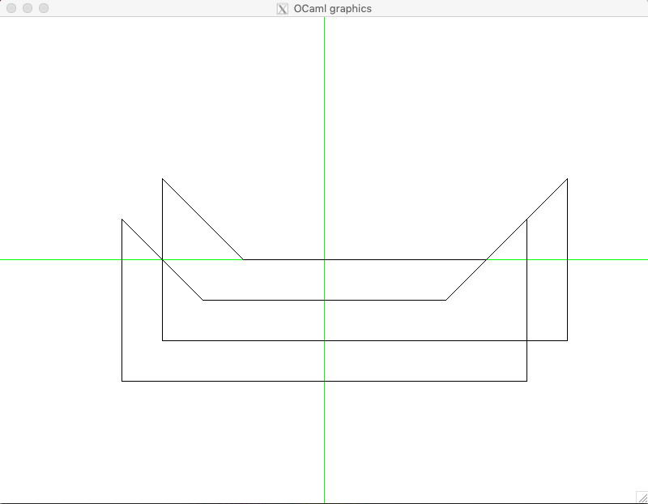
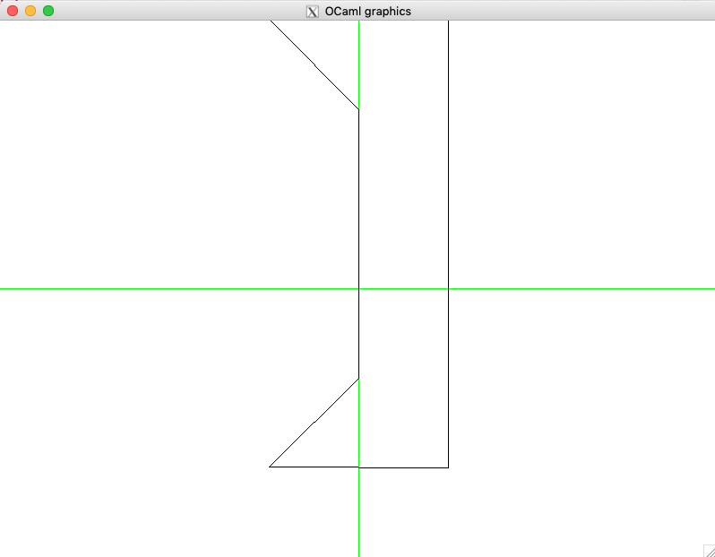

.. -*- mode: rst -*-

.. _polygons:

Working with Polygons
=====================

https://github.com/ilyasergey/ysc2229-geometry/blob/master/lib/Polygons.ml

From points and segments we move to more interesting two-dimensional objects --- polygons. 

To work with them, we will require a couple of auxiliary functions::

   include Points

   (* Some utility functions *)
   let rec all_pairs ls = match ls with
     | [] -> []
     | _ :: [] -> []
     | h1 :: h2 :: t -> (h1, h2) :: (all_pairs (h2 :: t))    

   let rec all_triples ls = 
     let (a, b) = (List.hd ls, List.hd @@ List.tl ls) in
     let rec walk l = match l with
       | x :: y :: [] -> [(x, y, a); (x, a, b)]
       | x :: y :: z :: t -> (x, y, z) :: (walk (y :: z :: t))    
       | _ -> []
     in
     assert (List.length ls >= 3);
     walk ls

Encoding and rendering polygons
-------------------------------

A polygon can be represented as a list of points::

 type polygon = point list 

We will use the following convention to interpret this list as a sequence of polygon vertices: as we "walk" along the list, the polygon is always on our left. OCaml's representation of polygons uses the same convention.

It is more convenient to define polygons as list of integers (unless we specifically need coordinates expressed with decimals), hence the following auxiliary function::

 let polygon_of_int_pairs l = 
   List.map (fun (x, y) -> 
       Point (float_of_int x, float_of_int y)) l

A very common operation is to shift polygon in a certain direction. This can be done as follows::

 let shift_polygon (dx, dy) pol = 
   List.map (function Point (x, y) ->
     Point (x +. dx, y +. dy)) pol

OCaml provides a special function ``draw_poly`` to render polygons, and we implement our machinery relying on it::

 let draw_polygon ?color:(color = Graphics.black) p = 
   let open Graphics in
   set_color color;
   List.map (function Point (x, y) -> 
     (int_of_float x + fst origin, 
      int_of_float y + snd origin)) p |>
   Array.of_list |>
   draw_poly;
   set_color black

Some useful polygons
--------------------

The following module defines a number of polygons with interesting properties::

 module TestPolygons = struct

   let triangle = 
     [(-50, 50); (200, 0); (200, 200)] |> polygon_of_int_pairs

   let square = [(100, -100); (100, 100); (-100, 100); (-100, -100)] |> polygon_of_int_pairs

   let convexPoly2 = [(100, -100); (200, 200); (0, 200); (0, 0)] |> polygon_of_int_pairs

   let convexPoly3 = [(0, 0); (200, 0); (200, 200); (40, 100)] |> polygon_of_int_pairs

   let simpleNonConvexPoly = [(0, 0); (200, 0); 
                              (200, 200); (100, 50)] |> polygon_of_int_pairs

   let nonConvexPoly5 = [(0, 0); (0, 200); 
                         (200, 200); (-100, 300)] |> 
                        polygon_of_int_pairs |>
                        shift_polygon (-50., -100.)

   let bunnyEars  = [(0, 0); (400, 0); (300, 200); 
                     (200, 100); (100, 200)] |> 
                    polygon_of_int_pairs |>
                    shift_polygon (-100., -50.)

   let lShapedPolygon = [(0, 0); (200, 0); (200, 100); 
                         (100, 100); (100, 300); (0, 300)]  
                        |> polygon_of_int_pairs
                        |> shift_polygon (-150., -150.)

   let kittyPolygon = [(0, 0); (500, 0); (500, 200); 
                       (400, 100); (100, 100); (0, 200)] 
                      |> polygon_of_int_pairs
                      |> shift_polygon (-250., -150.)

   let simpleStarPolygon = [(290, 0); (100, 100); (0, 290); 
                            (-100, 100); (-290, 0); (-100, -100); 
                            (0, -290); (100, -100)]  |> polygon_of_int_pairs

   let weirdRectPolygon = [(0, 0); (200, 0); (200, 100); (100, 100); 
                           (100, 200); (300, 200); (300, 300); (0, 300)]  
                          |> polygon_of_int_pairs
                          |> shift_polygon (-150., -150.)

   let sand4 = [(0, 0); (200, 0); (200, 100); (170, 100); 
                (150, 40); (130, 100); (0, 100)] 
               |> polygon_of_int_pairs
               |> shift_polygon (-30., -30.)

   let tHorror = [(100, 300); (200, 100); (300, 300); 
                  (200, 300); (200, 400)]  
                 |> polygon_of_int_pairs
                 |> shift_polygon (-250., -250.)

   let chvatal_comb = [(500, 200); (455, 100); (400, 100);
                       (350, 200); (300, 100); (250, 100);
                       (200, 200); (150, 100); (100, 100);
                       (50, 200); (0, 0); (500, 0)]
                      |> polygon_of_int_pairs
                      |> shift_polygon (-200., -70.)

   let chvatal_comb1 = [(500, 200); (420, 100); (400, 100);
                        (350, 200); (300, 100); (250, 100);
                        (200, 200); (150, 100); (100, 100);
                        (50, 200); (0, 70); (500, 70)]  
                       |> polygon_of_int_pairs
                       |> shift_polygon (-200., -70.)

   let shurikenPolygon = [(390, 0); (200, 50); (0, 290); 
                          (50, 150); (-200, -100); (0, 0)]  
                         |> polygon_of_int_pairs
                         |> shift_polygon (-80., -70.)

 end

Let us render some of those::

 utop # open Polygons;;
 utop # open TestPolygons;;
 utop # mk_screen ();;
 utop # draw_polygon kittyPolygon;;
 utop # let k1 = shift_polygon (50., 50.) kittyPolygon;;
 utop # draw_polygon k1;;

Basic polygon manipulations
---------------------------

In addition to moving polygons, we can also resize and rotate polygons. The first operation is done by multiplying all vertices (as they were vectors) by the defined factor::

 let resize_polygon k pol = 
   List.map (function Point (x, y) ->
     Point (x *. k, y *. k)) pol

For rotation, we need to specify the center, relative to which the rotations is going to be performed. After that the conversion to polar coordinates and back does the trick::

 let rotate_polygon pol p0 angle = 
   pol |>
   List.map (fun p -> p -- p0) |>
   List.map polar_of_cartesian |>
   List.map (function Polar (r, phi) -> 
       Polar (r, phi +. angle)) |>
   List.map cartesian_of_polar |>
   List.map (fun p -> p ++ (get_x p0, get_y p0))

Here is an example of using thoe functions::

 utop # let k2 = rotate_polygon k1 (Point (0., 0.)) (pi /. 2.);;
 utop # clear_screen ();;
 utop # draw_polygon k2;;

Queries about polygons
----------------------

One of non-trivial properties of a polygon is *convexity*. A polygon is convex if any segment connecting points on its edges fully lies within the polygon. That is, checking convexity out of this definition is cumbersome, and there is a better way to do it, by relying one the machinery for determining directions. In essence, a polygon is convex if each three consecutive vertices in it do not form a right turn::

 let is_convex pol = 
   all_triples pol |>
   List.for_all (fun (p1, p2, p3) -> direction p1 p2 p3 <= 0)

Another property to check of two fixed polygons, is whether they intersect, which would mean a collision. This can be checked in a time proportional to the product of the sizes of the two polygons, via the following functions, checking pair-wise intersection of all of the edges::

 let edges pol = 
   if pol = [] then []
   else 
     let es = all_pairs pol in
     let lst = List.rev pol |> List.hd in
     let e = (lst, List.hd pol) in
     e :: es

 let polygons_touch_or_intersect pol1 pol2 =
   let es1 = edges pol1 in
   let es2 = edges pol2 in
   List.exists (fun e1 ->
     List.exists (fun e2 -> 
           segments_intersect e1 e2) es2) es1

Intermezzo: rays and intersections
----------------------------------

The procedure above only checks for intersection of edges, but what is one polygon is fully within another polygon? How can we determine that? To answer this question, we would need to be able to determine whether a certain *point* is within a given polygon. But for this we would need to make a small detour and talk about another geometric construction: rays.

Ray is similar to a segment, but only has one endpoint, spreading to the infinity in a certain direction. This is why we represent rays by its origin and an angle in radians (encoded as ``float``), determining the direction in which it spreads::

 type ray = point * float

 let draw_ray ?color:(color = Graphics.black) r = 
   let (p, phi) = r in
   let open Graphics in
   let q = p ++ (2000. *. (cos phi), 2000. *. (sin phi)) in
   draw_segment ~color (p, q)

Given a ray :math:`R = (p, \phi)` and a point :math:`p` that belongs to the line of the ray, we can determine whether :math:`p` is on :math:`r` by manes of the following function::

 let point_on_ray ray p = 
   let (q, phi) = ray in
   (* Ray's direction *)
   let r = Point (cos phi, sin phi) in
   let u = dot_product (p -- q) r in
   u >=~ 0.

Notice that here we encode all points of :math:`R` via the equation :math:`q + u r`, where :math:`r` is a "directional" vector of the ray and :math:`0 \leq u`. We then solve the vector equation :math:`p = q + u r`, by multiplying both parts by :math:`r` via scalar product, and also noticing that :math:`r \cdot r = 0`. Finally, we check if :math:`u \geq 0`, to make sure that :math:`p` is not lying "behind" the ray.

Point within an polygon
-----------------------
