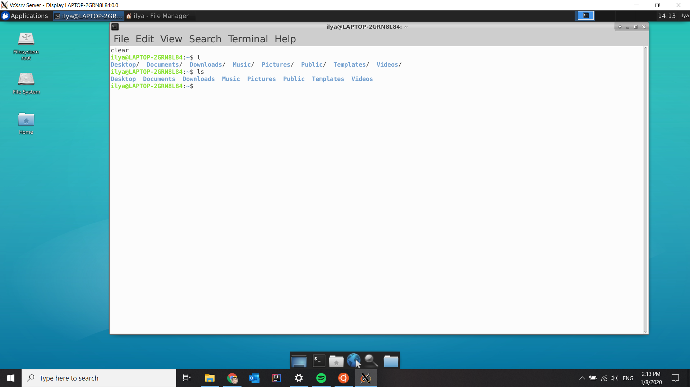
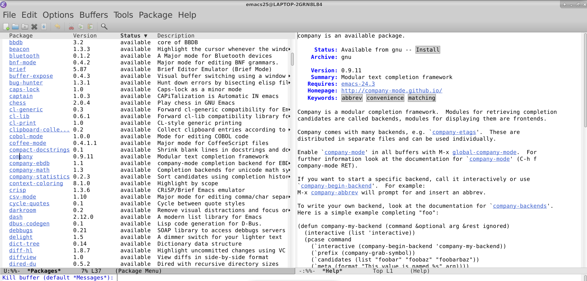
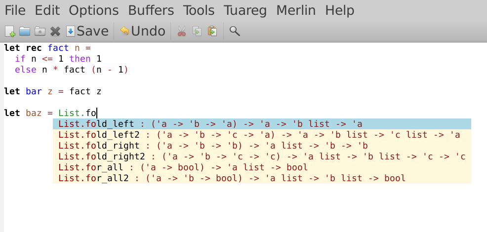
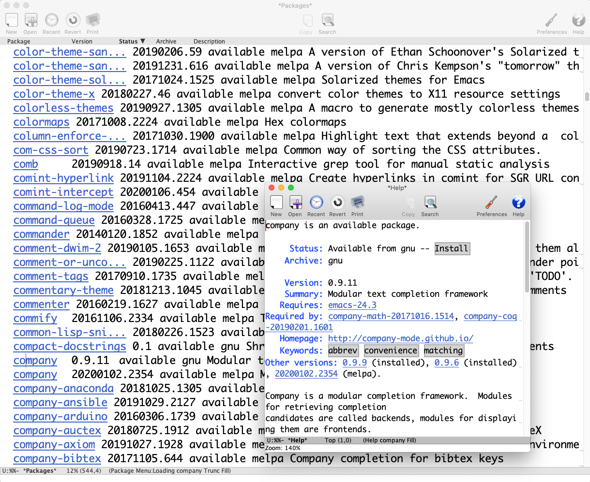
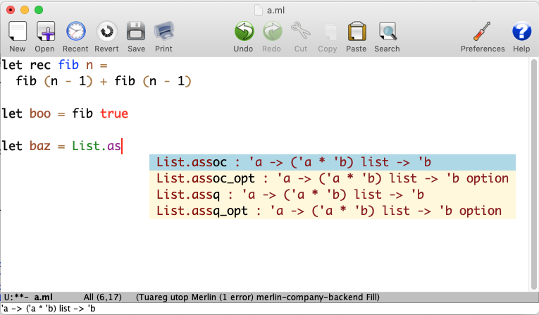

.. -*- mode: rst -*-

Installing OCaml Libraries and Setting up Editors
=================================================

First, we need to install all the software necessary for fully fledged OCaml
development. The instructions on how to do so are provided below. If you
followed the instructions, but something is not working as it should, check out
the Troubleshooting section at the end of this page.

Microsoft Windows 10
--------------------

Unfortunately, the OCaml infrastructure is not supported well on
Windows (natively), therefore developing large multi-file projects in
it is problematic. To circumvent this issue, we will be running OCaml
and the related software using `Windows Subsystem for Linux
<https://docs.microsoft.com/en-us/windows/wsl/install-win10>`_, a
utility that allows to run a distribution of Linux within your Windows
10 system. This setup takes a large number of steps, but once you're
done with it, you'll have a premium support for OCaml, and also a
fully functional Linux distribution installed on your machine.

1. First, let us enable WSL and install a Linux distribution. The
   detailed steps are given in `this online tutorial
   <https://solarianprogrammer.com/2017/04/15/install-wsl-windows-subsystem-for-linux/>`_.
   Don't forget the password for the Linux account you've just
   created: you will need it to install some software. At the end of
   this step, you should be able to run a "bare-bone" Ubuntu Linux
   terminal as an application within your Windows system. In my case, it
   looks as follows.

.. image:: ../resources/howto/ubuntu.png
   :width: 820px
   :align: center

2. You can access your Windows home folder from WSL Linux via tha path
   ``/mnt/c/Users/YOURNAME/`` where ``YOURNAME`` is your Windows user
   name. It is convenient to make a symbolic link for it, so you could
   access it quickly, for instance, calling it ``home``. This is how
   you create such a link::

     cd ~
     ln -s /mnt/c/Users/YOURNAME/ home

   Now you can navigate to you Windows home folder via ``cd ~/home`` and to
   your Linux home folder via ``cd ~``.

2. Next, we need to install a graphical shell for the Linux
   distribution running in WSL. `This article
   <https://solarianprogrammer.com/2017/04/16/windows-susbsystem-for-linux-xfce-4/>`_
   provides detailed instructions on how to do so. Here are some
   comments:

   * You don't have to install Firefox in WSL Linux, as you can use
     your Windows browser instead.

   * The required graphical XServer shell (run separately from
     Windows) can be downloaded from `this resource
     <https://sourceforge.net/projects/vcxsrv/>`_.

   * To run Linux with the graphical mode, you will `always` have to
     first run the XServer, and then the Ubuntu shell, in which you
     will have to type ``xfce4-session``. The Ubuntu window will have
     to stay running as long as you use Linux.
     
3. If the Linux image appears to be somewhat "blurred", here's how to fix it:

   * First, add the following lines at the end of the file
     ``~/.bashrc`` in your Linux home folder::

      export GDK_SCALE=0.5
      export GDK_DPI_SCALE=2          

     This can be done using the ``nano`` editor, similarly to how it
     is done in  `this tutorial <https://solarianprogrammer.com/2017/04/16/windows-susbsystem-for-linux-xfce-4/>`_.
     
   * Next, close any running instance of that X server (VcxSrv). Open
     the folder where you have installed it (e.g., ``C:\Program
     Files\VcXsrv``),
     right click on ``vcxsrv.exe``. Choose `Properties > Compatibility tab > Change high DPI
     settings > Enable Override high DPI scaling` and change it to
     ``Application`` option. Here is the screenshot looks like after
     changing the settings:

.. image:: ../resources/howto/blur.png
   :width: 820px
   :align: center

4. Once you have done all of this, you can run Linux terminal within the
   graphical XFCE shell and execute all commands from it, rather than
   from a Windows-started Ubuntu terminal. In my case, it looks
   as follows:

5. It's time to install OCaml libraries. First, we need to install a number of
   Linux packages that OCaml needs. Run the following lines from Linux terminal
   (it can be done both from within graphical shell, or from within a separate
   Ubuntu terminal run as a Windows applications)::

    sudo apt install make m4 gcc pkg-config libx11-dev

   Don't forget to enter the password you've created for your Linux account, it
   might be different from your Windows one. Be patient: installing those
   packages will take quite some time.

6. Next, we will install the ``opam`` package manager for working with different OCaml libraries. Execute the following lines from Linux terminal::

    sudo add-apt-repository ppa:avsm/ppa
    sudo apt install opam
    opam init -y --compiler=4.10.0 --disable-sandboxing
    eval $(opam env)
    opam install -y dune core batteries utop graphics merlin ocp-indent

   Once done, add the following line to your ``~/.bashrc`` file::

    eval $(opam env) 

   After that, close your terminal window and start a new one.

   To check that your OCaml is correctly installed, run ``ocamlc --version`` from the terminal. You should get the output
   ``4.10.0``, which is the version of the OCaml compiler we have just installed.

7. **If you're planning to use VSCode instead of Emacs, please, skip to the step 12.**

   Now we need to install the OCaml support for Emacs. Emacs can be installed
   using the instructions given `in this article
   <https://solarianprogrammer.com/2017/05/18/emacs-windows-subsystem-linux/>`_.

   To use Emacs comfortably with Windows-like shortcuts, you will need to enable the `Cua mode <https://www.emacswiki.org/emacs/CuaMode>`_ for it. 
   To enable Cua mode, create the file ``.emacs`` in you Linux home folder (i.e., it should be located under ``~/.emacs``) and add the following lines to it (or just append them to the file if it already exists)::

    (cua-mode t)
    (setq cua-auto-tabify-rectangles nil) ;; Don't tabify after rectangle commands
    (transient-mark-mode 1) ;; No region when it is not highlighted
    (setq cua-keep-region-after-copy t) ;; Standard Windows behaviour

8. To continue with installing Emacs, Execute the following from terminal::

    opam install -y tuareg user-setup
    opam user-setup install --editors=emacs

   The last touch is to add the code completion feature to Emacs. Open Emacs and execute
   `Alt-X package-list-packages`. From the list choose `company -> Install -> Yes`:

9. Add the following lines to your ``~/.emacs`` configuration::

    ; Make company aware of merlin
    (with-eval-after-load 'company
    (add-to-list 'company-backends 'merlin-company-backend))
    ; Enable company on merlin managed buffers
    (add-hook 'merlin-mode-hook 'company-mode)

   Some additional information about this Emacs mode can be found `here <https://github.com/ocaml/merlin/wiki/emacs-from-scratch>`_.

10. You're good to go. To check your setup, create an OCaml file in
    Emacs (e.g., ``a.ml``) and try to play with some definitions. The
    editor should highlight OCaml syntax, compile-time errors, and
    will suggest options for name auto-completion:

11. [Optional] You can additionally setup the following parameters in Emacs for better
    editing by searching in ``Options -> Customize Emacs -> Top-level
    Customization Group``:

    * Set the width of the buffer line to cut automatically beyond 80 characters
      (parameter ``Fill Column``):   

      .. image:: ../resources/howto/line80.png
         :width: 820px
         :align: center

    * Remove the red highlighting of trailing whitespaces in the buffers
      (parameter ``Show Trailing Whitespace``):

      .. image:: ../resources/howto/trailing.png
         :width: 820px
         :align: center

12. You can use `VSCode <https://code.visualstudio.com/>`_ instead of
    Emacs for your development, assuming you've done steps 1-6.

    Start by installing the Remote-WSL plugin. It is the one suggested the
    firsrt time you run VSCode. Alternatively, you can install it by pressing
    ``Ctrl-Shift-P``, typing "install extensions", and choosing "Install
    Extensions" item from the dropdown menu, and then finding and installing the
    "Remote-WSL" extension.

    After installing that extension, press ``Ctrl-Shift-P`` and choose
    "Remote-WSL: New Window". This will take a few seconds and will start a new
    window of VSCode that runs **inside your WSL Linux** (you can even start a
    Linux terminal there).

    Next, **in this remote window**, install the exntesion "OCaml and Reason
    IDE" in the same way as described above.

    Now, you can open an OCaml file (``Ctrl-Shift-P``, followed by "File: Open
    File") and enjoy the advanced features: highlighting, code completion, and
    type information, as well as many others. An example of the UI is shown
    below. Notice the indicators at the bottom of the screen, showing that
    VSCode runs in WSL (Ubuntu), with OCaml/merlin support enabled:

Linux
-----

If you're using Linux, the setup is similar to the one for Windows 10 WSL
described previously. Just follow the points above starting from the step 5. If
you're using a distribution different from Ubuntu, make sure to use the
corresponding package manager (instead of ``apt``) to get the system packages in
the step 5.

If you wish to use VSCode, just follow the instructions in step 12 for Windows
10 WSL, skipping the part about Remote-WSL and remote window and starting from
installing the "OCaml and Reason IDE" extension.

macOS
-----

OCaml is well supported in macOS, so the installation process is fairly straightforward.

1. Install the `Homebrew package manager <https://brew.sh/>`_ for macOS.

2. Install the following system packages using Homebrew::

     brew install make m4 gcc pkg-config

3. Install the `XQuartz <https://www.xquartz.org/>`_ X window system
   for macOS. Make sure it `before` you install ``opam`` and all
   libraries from it. We will need this library for a few graphical
   applications at the end of this course. 

   Once you have done it, **log-out from the system and log-in again**.

4. Next, we will install the ``opam`` package manager for installing
   and maintaining different OCaml libraries. Execute the following
   lines from the terminal::

    brew install opam
    opam init -y --compiler=4.10.0
    eval $(opam env)
    opam install -y dune core batteries utop graphics merlin ocp-indent

   Once done, add the following line to your ``~/.bashrc`` or ``~/.profile``
   files (if they exist, otherwise create ``~/.bashrc``)::

    eval $(opam env)   

   After that, close your terminal window and start a new one.

   Notice that if you had some ``opam`` installation before completing
   step 4, the installation of the ``graphics`` package will fail. To
   avoid it, please, run this line first before installing the listed
   above packages::

     opam switch reinstall 4.10.0

   To check that your OCaml is correctly installed, run ``ocamlc --version``
   from the terminal. You should get the output ``4.10.0``, which is the version
   of the OCaml compiler we have just installed.

5. **If you're planning to use VSCode instead of Emacs, please, skip to the step 10.**

   Now we need to install the OCaml support for Emacs. As an Emacs-like editor,
   I suggest to use `Aquamacs <http://aquamacs.org/>`_. Please, download and
   install it.

6. To continue with installing Emacs, Execute the following from terminal::

    opam install -y tuareg.2.0.8 user-setup 
    opam user-setup install --editors=emacs

   It is important that you install ``touareg`` version 2.0.8, as other versions
   might cause Emacs-related issues when compiling.
   The last touch is to add the code completion feature to Aquamacs. First, add
   these lines to your ``~/.emacs`` file (create it if it doesn't exist)::

    ;; Melpa
    (require 'package)
    (add-to-list 'package-archives
             '("melpa-stable" . "https://stable.melpa.org/packages/") t)
    (package-initialize)
   
   Restart Aquamacs. Once it's reopened, execute company-mode for completion
   `Option-X package-list-packages`. From the list choose `company -> Install -> Yes`:

7. Add the following lines to your ``~/.emacs`` configuration::

    ; Make company aware of merlin
    (with-eval-after-load 'company
    (add-to-list 'company-backends 'merlin-company-backend))
    ; Enable company on merlin managed buffers
    (add-hook 'merlin-mode-hook 'company-mode)

   Some additional information about this Emacs mode can be found `here <https://github.com/ocaml/merlin/wiki/emacs-from-scratch>`_.

8. You're good to go. To check your setup, create an OCaml file in
   Emacs (e.g., ``a.ml``) and try to play with some definitions. The
   editor should highlight OCaml syntax, compile-time errors, and will
   suggest options for name auto-completion:

9. [Optional] You can additionally setup the following parameters in Emacs for better
   editing by searching in ``Options -> Customize Aquamacs -> Top-level
   Customization Group``:

   * Set the width of the buffer line to cut automatically beyond 80 characters
     (parameter ``Fill Column``):   

     .. image:: ../resources/howto/line80.png
        :width: 820px
        :align: center

   * Remove the red highlighting of trailing whitespaces in the buffers
     (parameter ``Show Trailing Whitespace``):

     .. image:: ../resources/howto/trailing.png
        :width: 820px
        :align: center

10. You can use `VSCode <https://code.visualstudio.com/>`_ instead of Aquamacs,
    assuming you've done the steps 1-4.

    First, you you will need to install the `OCaml and Reason IDE extension
    <https://marketplace.visualstudio.com/items?itemName=freebroccolo.reasonml>`_,
    which enables OCaml support in VSCode (assuming you have installed all
    libraries above via ``opam`` in the step 5). You can install the extension
    by pressing ``Command-Shift-P``, typing "Install Extensions", and choosing
    that item from the dropdown menu.
   
    Now, if you open an OCaml file, it will look like that:

 
Troubleshooting
---------------

1. **Problem**: In-line tests are highlighed red in my editor with an error message
   ``ppx_inline_test: extension is disabled because the tests would be ignored
   ...``.

   **Solution**: This is a bug in a certain version of the tests. To fix it, install a
   fixed version of the testing liberary as follows::

     opam install -y ppx_inline_test.v0.14.0

   Then, in your project, run ``make clean; make``. After that, the error in the
   editor should be gone.

2. **Problem**: Merlin is not detected by VSCode, which gives an error
   "``ocamlmerlin`` is not found".

   **Solution**: This is the case if you didn't add ``eval $(opam env)`` to the
   configuration files (e.g., ``~/.bashrc`` and/or ``~/.profile``). Adding it
   and restarting VSCode should fix it.

   Alternatively, you can add the following lines to the ``settings.json``
   file (with your account name instead of ``YOURNAME``). To find that file,
   press ``Command-Shift-P`` and choose "Preferences: Open Settings (JSON)"
   (to find it just type "settings" and choose the correct option)::

      "reason.path.ocamlmerlin": "/Users/YOURNAME/.opam/4.10.0/bin/ocamlmerlin"

   For example, in my case the contents of this file look as follows::

      {
          "window.zoomLevel": 2,
          "search.searchOnType": false,
          "reason.path.ocamlmerlin": "/Users/ilya/.opam/4.10.0/bin/ocamlmerlin"
      }

   Don't forget to save the file. 

3. **Problem**: When installing ``tuareg`` mode with ``opam``, I get an error::
     
     [ERROR] The compilation of conf-emacs failed at ...

   **Solution**: This can be solved by installing a particular version 2.0.8 of
   ``tuareg``::

     opam install tuareg.2.0.8

   Another way to fix it is to ensure that the executable ``emacs`` is in your
   ``PATH``. This can be done by, e.g., installing ``emacs`` via Homebrew::

     brew install aquamacs

